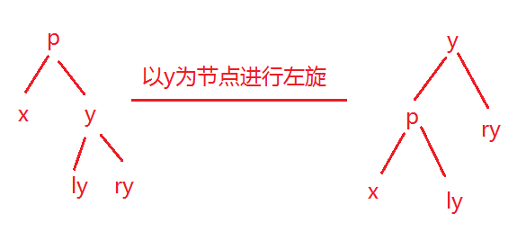
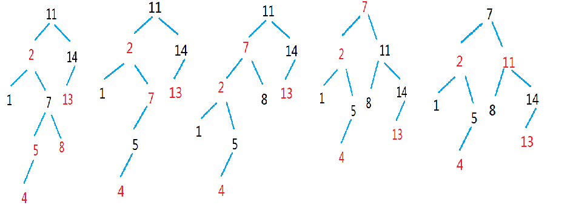

- ##  红黑树

    - > 1. 红黑树本质上是一棵自平衡二叉树
    - > 2. 二叉树的特点
        >> - 每一个节点都可以有2个子节点
        >> - 左子树以及右子树都是二叉树
        >> - 左子树都小于根节点，右子树都大于根节点
    - > 3. 红黑树的特点
        >> - 每一个节点非红即黑
        >> - 根节点一定是黑节点
        >> - 红节点下面一定是黑节点，但是黑节点下面没有限制
        >> - 最底层的叶子节点一定是黑色的空节点(NIL)
        >> - 任意一条路径经过的黑节点个数一致，即黑节点高度一致
        >> - 新添加的子节点一定是红节点
    - > 4. 通过红黑树的修正过程，保证了红黑树的平衡性
    - > 5. 红黑树的时间复杂度是O(logN)

- ## 红黑树的修正
    - > 1. 当前节点为红并且父节点为红，叔父节点也为红色，将父节点以及叔父节点涂黑，将祖父节点涂红
    - > 2. 当前节点为红并且父节点为红，叔父节点为黑色，当前节点是右子叶，要以当前节点为基准进行左旋
        >> 

        >> 
<mark>左旋图示</mark>

        >> 
        >> 
        >> 

        >>
    - 3. 当前节点为红并且父节点为红，叔父节点为黑色，当前节点是左子叶，要以父节点为基准进行右旋
        >> 

        >> 
<mark>右旋图示</mark>

        >> 
        >> 
        >> 

        >>
    - 4. 调整颜色
    - > 一般来讲，有第2 步就一定会有第三步。但是也有可能 没有第2步，直接就是第3 步。
        >> 

        >> 
<mark>红黑树修正图示</mark>

        >> 
        >> 
        >> 

        >>

