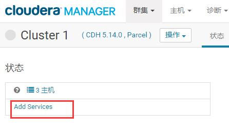

我在没有添加服务的情况下掉线了。然后还没选择添加的服务。这个时候可以找到一个集群，然后选择`add services` 进行新添加

前提准备
    创建Hive 数据库
    创建amon 数据库

将cm 压缩包解压到 /opt 目录
    tar -zxvf cloudera-manager-el6-cm5.14.0_x86_64.tar.gz

拷贝一个 mysql 数据库驱动包
    cp ~/mysql-connector-java-5.1.34-bin.jar /opt/cm-5.14.0/share/cmf/lib/

准备Cloudera Manager Server数据库 使用脚本命令
    /opt/cm-5.14.0/share/cmf/schema/scm_prepare_database.sh mysql cm -htarena01 -uroot -proot --scm-host tarena01 scm scm scm
    [数据库类型mysql] [数据库名]  -h [数据库所在主机]  -u [用户名] -p [密码] --scm-host [当前主机] scm scm scm
    这里有个问题就是我想将数据库创建在远程计算机上没有成功。不知道为什么！！！！！！

配置代理 `vim /opt/cm-5.14.0/etc/cloudera-scm-agent/config.ini`
    修改: server_host=tarena01

拷贝相关文件到指定目录，交对其中一个文件进行改名

    [root@tarena01 parcel-repo]# cd /opt/cloudera/parcel-repo

    [root@tarena01 parcel-repo]# cp ~/CDH/CDH-5.14.0-1.cdh5.14.0.p0.24-el6.parcel /opt/cloudera/parcel-repo/
    [root@tarena01 parcel-repo]# cp ~/CDH/manifest.json /opt/cloudera/parcel-repo/
    [root@tarena01 parcel-repo]# cp ~/CDH/CDH-5.14.0-1.cdh5.14.0.p0.24-el6.parcel.sha1 /opt/cloudera/parcel-repo/
    [root@tarena01 parcel-repo]# mv /opt/cloudera/parcel-repo/CDH-5.14.0-1.cdh5.14.0.p0.24-el6.parcel.sha1 /opt/cloudera/parcel-repo/CDH-5.14.0-1.cdh5.14.0.p0.24-el6.parcel.sha

集群处理，将配置好的目录拷贝到另外两台节点计算机上
    scp -r -p /opt/cm-5.14.0/ tarena02:/opt/
    scp -r -p /opt/cm-5.14.0/ tarena03:/opt/

在所有节点创建 cloudera-scm 用户
    useradd --system --home=/opt/cm-5.14.0/run/cloudera-scm-server/ --no-create-home --shell=/bin/false --comment "Cloudera SCM User" cloudera-scm

如果之前创建过此用户可以使用下面的命令来删除
    userdel cloudera-scm
    这个命令是删除帐户，但是不删除其家目录。如果要删除其家目录，则需要添加一个参数: "-r"

在tarena01 启动服务 cm server
    [root@tarena01 parcel-repo]# /opt/cm-5.14.0/etc/init.d/cloudera-scm-server start

在所有节点启动代理 cm agent
    tarena01 上启动
    [root@tarena01 opt]# /opt/cm-5.14.0/etc/init.d/cloudera-scm-agent start

    tarena02 上启动
    [root@tarena02 opt]# /opt/cm-5.14.0/etc/init.d/cloudera-scm-agent start

    tarena03 上启动
    [root@tarena03 opt]# /opt/cm-5.14.0/etc/init.d/cloudera-scm-agent start

在浏览器上访问 cm
    http://tarena01:7180

    登录的用户名和密码都是: admin

在集群设置之前记得将mysql 的驱动包复制到hive
    在tarena01 节点上复制
    [root@tarena01 ~]# cp ~/mysql-connector-java-5.1.34-bin.jar /opt/cloudera/parcels/CDH-5.14.0-1.cdh5.14.0.p0.24/lib/hive/lib/

在集群设置的时候需要指定 hive 数据库以及amon 数据库

CDH 中没有集成 kafka ，所以需要单独处理这个kafka
    https://blog.csdn.net/huang66666666/article/details/85459153
    https://www.cnblogs.com/lenmom/p/9157087.html

