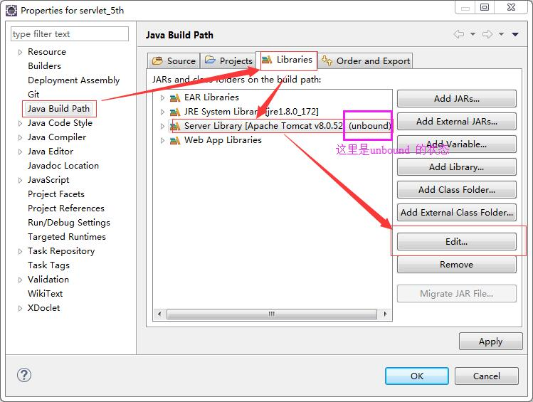
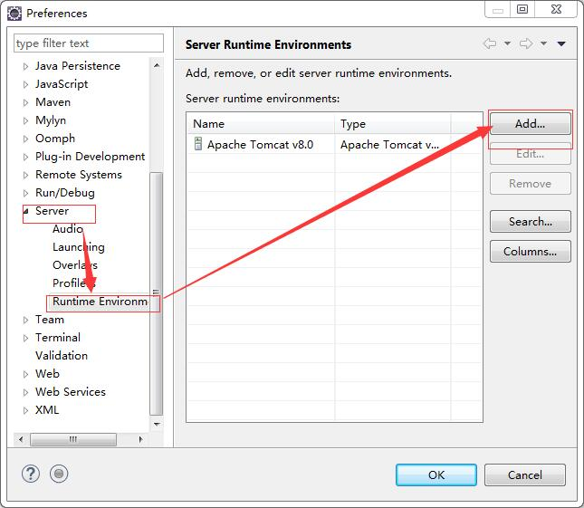
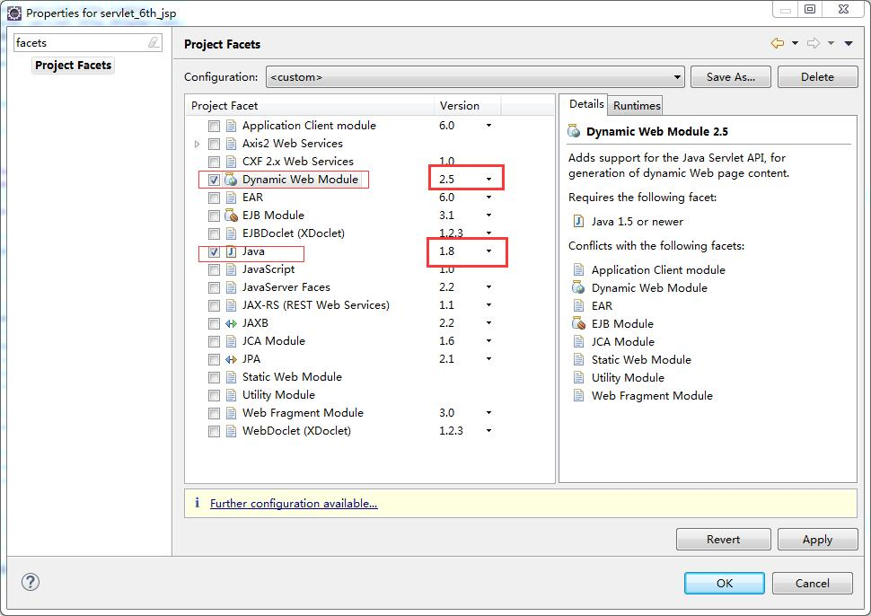

# eclipse 工程环境

## 一个已存在的工程绑定tomcat runtime 环境
----------------------
> 今天我在打开之前的一个Dynamic Web Project 工程的时候，一打开结果全是小红叉。搞了好久都没头绪，刚刚都睡下了一直睡不着，又起来百度了一下，还好找到问题了。 
> 我这里把解决方法记录下来，以便以后再出现的时候可以知道怎么处理。 

- 工程文件一开始是这样的，有很多的小红叉，显然环境不对有问题。 
    
    > 上图中的servlet_5th 和 servert_6th_jsp 两个项目就是从解决OK 之后的效果。其他几个是还没处理好的。 
    > 下面我就把处理的步骤记录下来。 
    1. `右键项目 --> Build Path --> Configure Build Path...` 将会出来一个对话框
        > 在对话框上可以看到 tomcat 是unbound(未绑定状态) 这就是我们要解决的根本 
        > 在此对话框上面，点击`Edit`按钮 
        
    2. 在弹出的对话框上选中一个 runtime 然后OK 就可以了。 
        
    > 如果没有这个runtime 选择的话，那么就需要创建一个tomcat runtime 环境了。

## 创建一个tomcat runtime
----
- `window --> Preferences` 打开一个窗口
    > 在这个窗口中找到`Server --> Runtime Environments` 选项 
    > 选择`Add...` 然后按步骤一步一步操作就可以了。
    
        
## 当一个项目无法添加到tomcat servers 中时，有时会报错。
- **报错There are no resources that can be added or removed from the server**
    > 处理方法：`右键项目 —-> properties --> Project Facets --> 勾选Dynamic Web Project和java` 等就可以了 
    > 但是要注意的是，后面会一一个版本的选择，选择正确的版本。 
    
    ------
    > 这样处理了之后会又会出现小红叉，这是jar 包引用的问题，再次引用一下就好了。 
    > `右键项目 --> Build Path --> Configure Build Path...` 
    > `Add library...` 
    > `Server Runtime`  
    > 然后选中一个runtime 就OK了。

