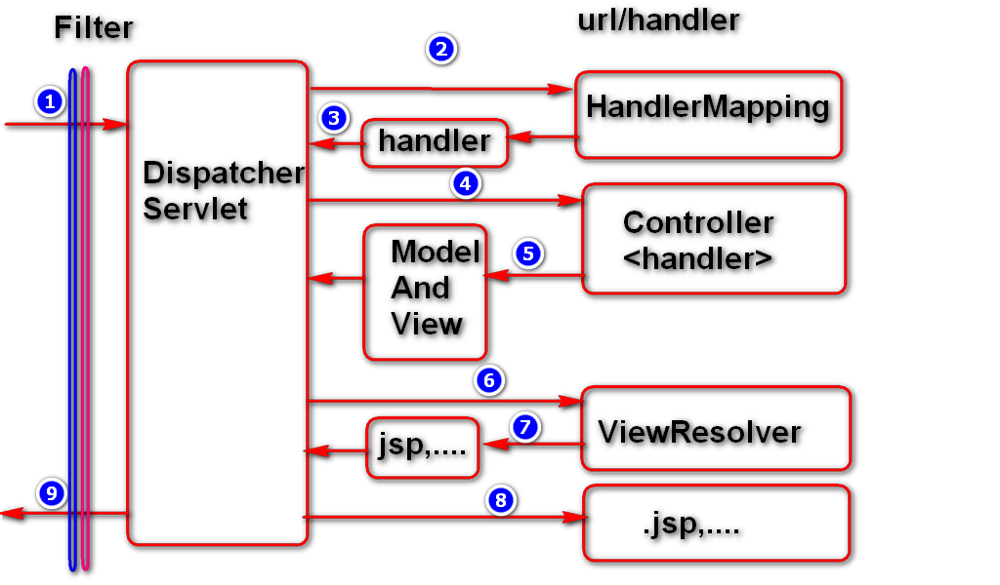

## **`Spring MVC` 项目实现**
- 配置`web.xml` tomcat 
    > `src/main/webapp/WEB-INF/web.xml`

        <!-- 注册servlet, 这个servlet 在spring-mvc 中充当前端控制器的角色 -->
        <servlet>
            <servlet-name>dispatcherServlet</servlet-name>
            <servlet-class>org.springframework.web.servlet.DispatcherServlet</servlet-class>
            <!-- 配置servlet 初始化参数 -->
            <init-param>
                <!-- 这个参数名由spring 定义的，必须是它，不能修改 -->
                <!-- 它是DispatcherServlet 的父类FrameworkServlet 中的一个属性: private String contextAttribute;  -->
                <param-name>contextConfigLocation</param-name>
                <!-- 这个是配置文件的文件名 -->
                <param-value>classpath:spring_mvc.xml</param-value>
            </init-param>
            <!-- 配置容器启动时即初始化这个servlet -->
            <load-on-startup>1</load-on-startup>
        </servlet>
        <!-- 配置servlet 映射 
            在客户端 发起请求时，URL 后缀必须为".do"
        -->
        <servlet-mapping>
            <servlet-name>dispatcherServlet</servlet-name>
            <url-pattern>*.do</url-pattern>
        </servlet-mapping>

- 引入XML 配置文件
    > 同样放在`src/main/resources` 目录下面。假定文件名: `spring_mvc.xml` 
    > 这个配置文件与spring-bean 的配置文件是一样的。 

    1. 直接使用XML 配置方法(无注解形式)
        > `spring_mvc.xml` 模板

            <?xml version="1.0" encoding="UTF-8"?>
            <beans xmlns="http://www.springframework.org/schema/beans"
                xmlns:p="http://www.springframework.org/schema/p" xmlns:xsi="http://www.w3.org/2001/XMLSchema-instance"
                xmlns:context="http://www.springframework.org/schema/context" xmlns:tx="http://www.springframework.org/schema/tx"
                xmlns:aop="http://www.springframework.org/schema/aop" xmlns:mvc="http://www.springframework.org/schema/mvc"
                xmlns:util="http://www.springframework.org/schema/util" xmlns:jpa="http://www.springframework.org/schema/data/jpa"
                xsi:schemaLocation="  
                http://www.springframework.org/schema/beans   
                http://www.springframework.org/schema/beans/spring-beans-4.3.xsd  
                http://www.springframework.org/schema/mvc   
                http://www.springframework.org/schema/mvc/spring-mvc-4.3.xsd   
                http://www.springframework.org/schema/tx   
                http://www.springframework.org/schema/tx/spring-tx-4.3.xsd   
                http://www.springframework.org/schema/aop 
                http://www.springframework.org/schema/aop/spring-aop-4.3.xsd
                http://www.springframework.org/schema/util 
                http://www.springframework.org/schema/util/spring-util-4.3.xsd
                http://www.springframework.org/schema/data/jpa 
                http://www.springframework.org/schema/data/jpa/spring-jpa-1.3.xsd
                http://www.springframework.org/schema/context
                http://www.springframework.org/schema/context/spring-context-4.3.xsd">

            </beans>
            
        > `spring_mvc.xml` 配置文件以及相关说明

            <!-- 将我们自己写的一个Controller的一个派生类交给Spring 进行管理 -->
            <bean id="helloController" class="cn.spring.controller.HelloController"></bean>
            
            <!-- 配置HandlerMapping(处理映射) 配置URL 与具体后端控制器之间的映射 -->
            <bean class="org.springframework.web.servlet.handler.SimpleUrlHandlerMapping">
                <property name="mappings">
                    <props>
                        <!-- url("/hello.do")  映射到 helloController(bean 对象) -->
                        <prop key="/hello.do">helloController</prop>
                    </props>
                </property>
            </bean>

            <!-- 配置视图解析器(解析 ModelAndView 对象中封装的view 信息 
                ${prefix} + viewName + ${suffix}  ==> /WEB-INF/pages/hello.jsp
            -->
            <bean class="org.springframework.web.servlet.view.InternalResourceViewResolver">
                <!-- 自动给后面action的方法return的字符串加上前缀和后缀，变成一个 可用的url地址 -->
                <property name="prefix" value="/WEB-INF/pages/"></property>
                <property name="suffix" value=".jsp"></property>
            </bean>

        > `Controller` 实现 
        > 需要实现接口`org.springframework.web.servlet.mvc.Controller`

            import javax.servlet.http.HttpServletRequest;
            import javax.servlet.http.HttpServletResponse;
            import org.springframework.web.servlet.ModelAndView;
            import org.springframework.web.servlet.mvc.Controller;

            // Spring MVC 中的后端控制器
            // 请求流程: 
            // 1) client request --> tomcat
            // 2) tomcat --> DispatcherServlet (web.xml)
            // 3) DispatcherServlet --> (查找映射关系: spring_mvc.xml) --> HelloController
            // 4) HelloController  -->  handleRequest(..)
            // 5) ...
            public class HelloController implements Controller {
                // 用于处理请求
                @Override
                public ModelAndView handleRequest(HttpServletRequest request, HttpServletResponse response) throws Exception {
                    // 构建模型和视图对象(作用: 封装数据)
                    ModelAndView mv = new ModelAndView();
                    mv.addObject("msg", "Hello SpingMVC");
                    mv.setViewName("hello"); // 设置呈现数据的页面(hello.jsp)
                    return mv; // (数据，视图)
                }
            }

        > `hello.jsp` 文件需要放在`/WEB-INF/pages/` 目录下面，这个在XML 文件中有配置。
            
            <body>
                <h1>${msg}</h1>
            </body>

        > 这样就可以在浏览器中使用URL(`http://localhost:8080/[项目名]/hello.do`) 进行访问了

    2. 使用注解 + XML 形式
        > `spring_mvc.xml` 配置 
        > 使用注解时也需要配置`视图解析器 InternalResourceViewResolver`

            <!-- 配置bean 的扫描 -->
            <context:component-scan base-package="cn.spring"></context:component-scan>
            
            <!-- 启用MVC 注解功能  -->
            <mvc:annotation-driven></mvc:annotation-driven>

            <!-- 配置视图解析器(解析 ModelAndView 对象中封装的view 信息 
                ${prefix} + viewName + ${suffix}  ==> /WEB-INF/pages/hello.jsp
            -->
            <bean class="org.springframework.web.servlet.view.InternalResourceViewResolver">
                <property name="prefix" value="/WEB-INF/pages/"></property>
                <property name="suffix" value=".jsp"></property>
            </bean>

        > `Controller` 的实现，无需实现接口 

        > 注解说明:  
        >> `@Controller` 这是`Spring IOC` 的注解，将这个类交给`Spring` 进行管理 
        >> `@RequestMapping(value="/hello/")` 这个应用在类上面，指定一层目录级别的映射 
        >> `@RequestMapping(value="doSayHello")` 应用在方法上面，指定在目录级别下面一级的映射关系 

        > 一: 普通使用`返回视图文件名` 

        >> `return "hello";` 这个返回值(`ViewName`)，将会给到视图解析器，由它来合成一个`WEB-INF/pages/hello.jsp` 来响应给浏览器 
        >>> 最终在浏览器上使用URL: `http://localhost:80/[项目名称]/[类映射@RequestMapping]/[方法映射@RequestMapping].do`来对其进行访问 
        >>> 这里面的`".do"` 来自`web.xml` 中的`dispatcherServlet` 的`<url-pattern>` 标签

            import org.springframework.stereotype.Controller;
            import org.springframework.ui.Model;
            import org.springframework.web.bind.annotation.PathVariable;
            import org.springframework.web.bind.annotation.RequestMapping;
            import org.springframework.web.servlet.ModelAndView;

            //http://localhost:80/[项目名称]/hello/doSayHello.do
            // hello --> annotationHelloController
            @RequestMapping(value="/hello/")
            @Controller
            public class AnnotationHelloController {

                // @param Model 用于封装数据
                // http://localhost:80/[项目名称]/[类映射@RequestMapping]/doSayHello.do
                // SimpleUrlHandlerMapping
                // 通过@RequestMapping 注解定义映射关系
                @RequestMapping(value = "doSayHello")
                public String doSayHello(Model model) {
                    model.addAttribute("msg", "Hello AnnotationHelloController");
                    System.out.println("model: " + model);
                    return "hello"; // 此字符串会交给视图解析器
                }
            }

        > 二: 返回一个`ViewAndModel` 对象 
        >> 在`ViewAndModel` 对象上添加`Key-Value` 数据，以及`ViewName` 文件名

            //http://localhost:80/[项目名称]/hello/doSayHello.do
            // hello --> annotationHelloController
            @RequestMapping("/hello/")
            @Controller
            public class AnnotationHelloController {
                // http://localhost:80/[项目名称]/[类映射@RequestMapping]/doSaveMsg.do?msg=message
                @RequestMapping("doSaveMsg")
                public ModelAndView doSaveMsg(String msg) {
                    System.out.println("msg = " + msg);
                    ModelAndView mv = new ModelAndView();
                    mv.setViewName("success");
                    mv.addObject("msg", msg);
                    return mv; // /WEB-INF/pages/success.jsp
                }
            }

        > 三: `rest` 风格 
        >> 利用URL 添加数据，来给到`Controlller`中 
        >> `@RequestMapping("doSayMsg/{abc}")` 这里面的`abc` 就是一个占位符，在URL 中这个位置上面的数据将会被这个处理方法(`doSayMsg`)取到。 
        >> 利用参数注解`@PathVariable("abc")` 将这个位置上的数据传给`msg` 参数 
        >>> URL: `http://localhost:80/[项目名称]/[类映射@RequestMapping]/doSayMsg/message.do` --> msg = "message"  

            //http://localhost:80/[项目名称]/hello/doSayHello.do
            // hello --> annotationHelloController
            @RequestMapping("/hello/")
            @Controller
            public class AnnotationHelloController {
                // http://localhost:80/[项目名称]/[类映射@RequestMapping]/doSayMsg/message.do
                // http://localhost:80/[项目名称]/[类映射@RequestMapping]/doSayMsg/aaaaaaa.do
                // @RequestMapping("doSayMsg/{?}")
                // public ModelAndView doSayMsg(@PathVariable("?") String msg) {
                // {abc}: abc 是一个占位符，它可以是任意一个字符串，能通过@PathVariable("abc") 来得到这个位置的值
                @RequestMapping("doSayMsg/{abc}")	// rest 风格 
                public ModelAndView doSayMsg(@PathVariable("abc") String msg) {
                    System.out.println("msg = " + msg);
                    ModelAndView mv = new ModelAndView();
                    mv.setViewName("success");
                    mv.addObject("msg", msg);
                    return mv; // /WEB-INF/pages/success.jsp
                }
            }

  

----

  

## **`Spring MVC` 处理URL 请求的流程处理分析**

    
- 处理流程: 
    1. 一个URL 请求会首先到达`DisPatcherServlet`，由它进行URL 的匹配。
        > 这个`DisPatcherServlet` 被配置在`web.xml` 中 
    2. `DisPatcherServlet` 会找到URL 相匹配的`handler(也就是我们实现的HelloController)`
        > `SimpleUrlHandlerMapping` 中能找到URL 所映射的`handler`  
    3. 在`hendler` 中处理URL 请求
        > 处理完成后，它会封装一个`ModelAndVeiw` 对象，将其返回 
    4. `DispatcherServlet` 解析并得到最终的结果，将其返回给请求方
        > 通过`InternalResourceViewResolver` 将视图解析处理得到HTML 格式的结果。
    - `DisPatcherServlet`: 核心前端处理(流程调度) 

- 解释说明: 
    - `SimpleUrlHandlerMapping`: (记录url 到handler 的映射) 
    - `HelloController`: (又称之为handler, 处理客户端请求) 
    - `ModelAndView`: (封装数据以及对应的视图) 
    - `InternalResourceViewResolver`: (负责视图解析，基于view 找到具体的view 对象，例如hello.jsp) 

