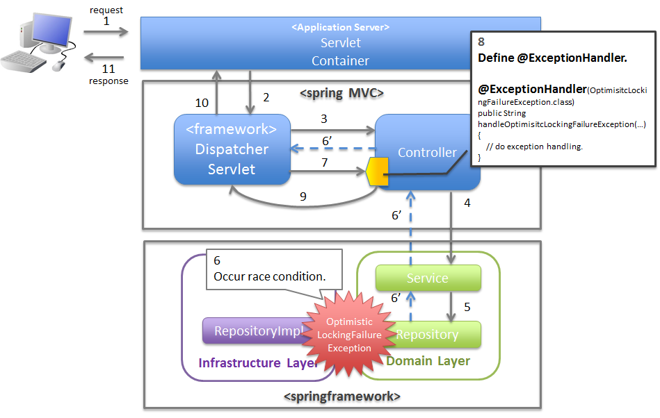

## 异常处理

- 控制器中对异常处理

        // 定义Controller 中的异常处理方法，这些方法需要借助ExceptionHandler 注解进行描述，
        // 注解中的内容表示我这个方法能够处理的异常(包括这个异常的子类类型)
        @ExceptionHandler(value=Exception.class)
        @ResponseBody
        public String handleException(Exception e) {
            return e.getMessage();
        }

- 全局环境中对异常处理

        // 说明：使用@ControllerAdvice 注解描述的类，一般作为全局的异常处理类
        @ControllerAdvice
        public class AdviceExceptionHandler {
            @ExceptionHandler(Throwable.class)
            @ResponseBody
            public String handlerException(Throwable e) {
                return e.getMessage();
            }
        }

- 说明:
    > 局部的异常处理的优先级是最低的。 
    > 也就是说如果一个异常同时可以被局异常处理和全局异常处理。那么它会被局部异常处理。 

