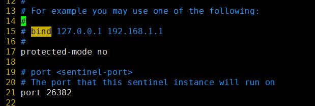

- ## 分布式集群的高可用
    > - 高可用需要做到对外提供 功能redis 节点一但宕机，不能影响集群的整体功能，不能数据大量未命中，这需要采用主从复制为基础的高可用结构

- ## 搭建redis 主从结构
    > 1. 配置多个redis 服务器
    >> - 拷贝redis.conf 文件多个。分别指定其不同的端口(6382、6383、6384)
    >>> - 根据redis-server 分布式配置相关文档进行修改配置
    >> 2. 启动这些redis 服务器
    >>> - 通过命令`info replication` 可以看到，这些服务器的角色都是master，且没有slaves
    >>>> 

    >>>> 
<mark>命令结果预览</mark>

    >>>> 
    >>>>        # Replication
    >>>>        role:master
    >>>>        connected_slaves:0
    >>>>        master_repl_offset:0
    >>>>        repl_backlog_active:0
    >>>>        repl_backlog_size:1048576
    >>>>        repl_backlog_first_byte_offset:0
    >>>>        repl_backlog_histlen:0
    >>>> 

    >> 3. 通过redis-cli 连接到6383 和6384 节点，将这两个节点挂载到6382 节点，使得它们都是6382 的从服务器
    >>> - 命令`slaveof <host> <port>`
    >>> - 这个时候再次使用`info replication` 命令可以查看他们三者的主从关系

- ## 哨兵高可用集群
    - ### 哨兵模式(sentinel)
        > - 启动哨兵进程后，将会自动监听管理配置时指定给他的主从结构中的主节点，利用info 命令查看主从的状态，rpc 心跳机制监听主节点状态；如果发现主节点宕机，会从记录的info信息中找到从节点进行投票选举；哨兵模式的哨兵进程也有多个，对主从管理时，会对事件进行投票。
        > - 对于单个哨兵主从高可用集群，只能负责存储数据分片中的一片，所以要做到分布式群集，还需要相同结构的高可用集群负责其他的分片存储；
        - java 代码联通时，可以连接哨兵集群，由哨兵集群转发数据传递给当前主从结构中的主节点，代码客户端 只要能连接哨兵，无需关心主从结构的实际情况。
    - ### 哨兵搭建
        - #### 有了主从关系之后，我们才可以使用哨兵来配置高可用集群了。
        > 

        > 
<mark>搭建哨兵配置</mark>

        > 
        > 1. 搭建好redis 主从结构
        >> - 查看前面的搭建过程，这里接上面的步骤继续后面的工作
        > 2. 修改哨兵模式的配置文件(`$(redis_root)/sentinel.conf`)
        >> - p15 行，注释掉bind 参数，IP 信息不绑定
        >> - p17 行，放开保护模式
        >> - p21 行，修改端口
        >>> 
        >> - p69 行，修改监听主从的挂接配置
        >> - `sentinel monitor mymaster 127.0.0.1 6379 2`
        >> - sentinel monitor :开始监听主从结构中的主节点
        >> - mymaster:监听当前主从结构的代号
        >> - ip:主节点所在的ip(使用内网地址)
        >> - port:主节点端口号
        >> - 2 : 主观下线票数(sentinel宕机后的最小投票数)选举新主节点失败时的时间延迟(第二轮选举和第一轮选举的时间间隔
        >>> 
        >> - p131 行 失败重新选举的超时时间，单位：毫秒
        >>> 
        > 

        - #### 搭建完成之后拷贝多份，修改端口，然后就可以开启多个哨兵
        > - 使用启动命令: `redis-sentinel <sentinel.conf>`

    > 启动好了之后，我们就可以做测试了，这个时候如果将主节点KILL 掉，那么哨兵 就会进行投票选一个新的主节点，如果那个被KILL 掉的节点重新连接上来，那么它会被设置为从节点。
    

