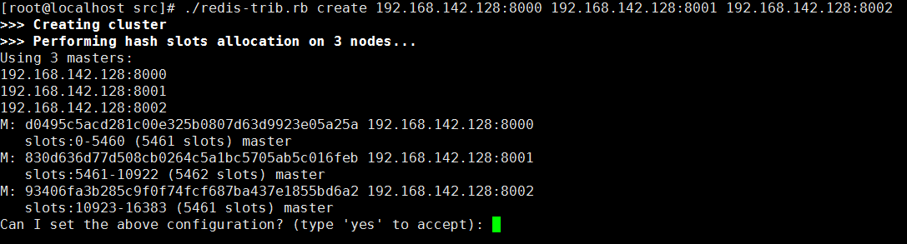
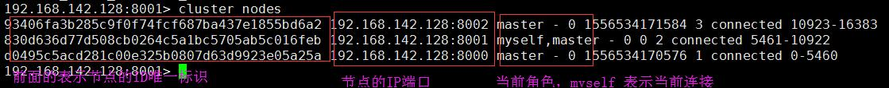

- ## Redis cluster 集群
    > - 之前我们学了Redis 以哨兵方式来搭建集群。这里我们学习一种新的集群的搭建方式: cluster。它是Redis 3.0 之后出现的一种新的技术；

- ### Redis cluster 集群的特点
    >> 

    >> 
<mark>redis-cluster 集群示例图</mark>

    >> 
    >> 
    >> 

    > - 集群里面的所有Redis 节点(包括从节点)之间两两相连；
    > - 它们内部使用二进制协议来优化传输速度；
    > - 哨后进程取消了，机制整合到了主节点的功能当中；
    > - 节点事件，例如 fail, 是通过过半选举得出的结论。所有集群的主节点参与选举(这个就是之前的哨兵功能)；
    > - 如果当前集群的有效主节点一但少于一半，集群将不可用；
    > - 客户端(jedit) 与redis-cluster 的联通不再是收集全部信息才能通信；只需要至少连接一个节点，就可以实现数据的分布式存储；
    > - redis-cluster 把所有的主节点映射到[0-16383]区间对应的“槽道”号上，各自主节点就维护了一个槽道号的分片区间；
    > - 当key 值在传入任何一个节点时，进行哈希取模运算，得到一个对应的槽道 号，然后才能由负责这个槽道 号对应的节点存储数据；

- ### Redis cluster 槽道图解
    >> 

    >> 
<mark>Redis cluster 槽道图解</mark>

    >> 
    >> 
    >> 

    > - 槽道需要解决两个问题
    >> 1. 获取数据的节点如何判断当前key 值的取模结果，它是否在自己的管理范围内；
    >> 2. 若不归自己管理时，如何获取正确的管理槽道 的节点。

- ### Redis cluster 集群的安装
    > - 因为集群命令文件需要ruby 语言的支持，所以我们首先需要安装ruby(ruby-2.3.1)
    > - 使用yum 安装gems
    >> - 它是一个Ruby 组件进行打包的Ruby 打包系统; 
    >> - 它提供一个分发Ruby 程序和库的标准格式，还提供一个管理程序包安装的工具。
    >> - 简单理解就是ruby 运行时，需要的各种插件都在gems 里;
    > - 使用命令`gem install redis` 安装redis 接口包
    > - 最后，Redis 必须安装 

- ### Redis cluster 集群的配置、使用与测试
    - > #### 创建节点(为每一个节点进行配置)
        > - 我们首先创建6 个Redis 节点，分别为其分配一个目录，以端口为其命令目录名；
        >> - `mkdir 8000 8001 8002 8003 8004 8005`
        > - 配置文件(redis.conf 模板文件), 先配置好一个模板文件，然后为每一个不同的节点修改端口
        >> 

        >> 
<mark>Redis cluster 详细配置说明</mark>

        >> 
        >> - p61 行，注释掉`bind ` 相关的配置，表示它允许任何IP 来进行访问
        >> - P80 行, `protected-mode no`    表示不使用保护模式，即不需要密码来进行登录
        >> - p84 行，`port 8000` 指定访问端口
        >> - p128 行，`daemonize yes` 指定以守护进程运行
        >> - p150 行，`pidfile /var/run/redis_8000.pid`  pidfile 文件对应8000
        >>> - 当大量的进程启动后，很难通过 ps - ef | grep redis-server 直接寻找到你需要操作的进程的PID
        >> - p163 行，`logfile "8000/redis.log"`  指定一个日志文件
        >> - p224 行，`rdbcompression yes` 指定一个当前服务加载的持久化文件
        >> - p593 行，`appendonly yes` 默认是rdb 方式持久化，要改成AOP 模式
        >>> - rdb 持久化和aof 持久化模式对比: 
        >>>> - rdb: 需要客户端必须调用命令 save 完成数据从内存保存到磁盘的操作；没有来得及save 的数据一但丢失，数据出现未命中；
        >>>> - aof: 二进制的日志，实时记录redis 客户端操作时所有写命令；没有来得及save 的数据不保存在dump 里，但是命令内容，保存在了aof 文件，恢复时，只需要将没save 的所有内容的命令调出来。
        >>>>> - 小数量的性能对比：开启aof 模式，比rdb 单独使用，多消耗2 时间
        >>>>> - 海量数据：同时开启aof 和rdb, 单独开启rdb 消耗近似；
        >> - p721 `cluster-enabled yes`   
        >>> - 加载当前配置文件的redis 服务一但启动需要开启集群模式，否则无法使用集群的各种策略和逻辑
        >> - p729 `cluster-config-file nodes-8000.conf`  
        >>> - 集群配置启动后，将会创建这个nodes 文件，记录当前服务器上唯一 的一个集群状态；
        >>>> - 例如搭建了8000-8005 这样一个集群，操作失误下，集群失效，重新搭建集群，当前服务器读取这个配置文件会发现，槽道已经被一个集群分配了，新的集群搭建失败；
        >>>> - 这个时候我们将这些文件删除掉就可以新建成功了。重启的时候也需要将这些文件给删除。
        >>>> - 还有`dump` 数据文件删除，防止启动起来之后，数据非空而失败。
        >> - p735 `cluster-node-timeout 15000`  请求超时 默认15 秒
        >> 

    
    - > 按上面的配置说明分明配置出多个，然后各自修改其端口号就可以启动了。
        > - 通过命令`redis-server 8000/redis.conf` 将6 个节点全部启动起来
        > - `cluster` 集群的连接命令需要添加一个 `-c` 参数: `redis-cli -c -p 8000`
        >> - -c 以集群状态登录节点(本质上是对单个节点的命令封装);
        >> - 但是这个时候所有的节点并不是集群状态,我们单独登录节点一样无法实现集群的操作
    
    - > #### 创建集群
        > - 在redis 根目录的src 目录下面有一个ruby 命令`redis-trib.rb`
        >> - 它是一个ruby 语言编写的快速操作集群的命令，整合了底层客户端 的各种各样的命令
        > - 执行创建集群命令(redis 集群最少需要3 个master 才能正常运行) 
        >> - `redis-trib.rb create 192.168.142.128:8000 192.168.142.128:8001 192.168.142.128:8002`
        >>> - 这个命令执行前，这些节点需要是正在运行状态。
        >>> - 它有一个`--replicas 1` 参数，用来为每一个master 自动添加至少一个从节点。这里我们没有使用。
        >>> - 然后会有一个是否接受槽道的分配方式, yes 就好
        >>>> 
        >> - 这个时候集群就搭建成功了，但是我们还没有为他们指定从节点。所以无法做到高可用。
        >> - 我们可以使用`redis-cli -c -p 8000` 登录到上面使用命令查看它们的一些状态信息
        >>> - 查看集群状态: `cluster info`
        >>>> 
        >>> - 查看集群节点: `cluster nodes`
        >>>> 
    - > #### 动态添加节点到这个集群中
        > - `[root@localhost src]# ./redis-trib.rb add-node 192.168.142.128:8005 192.168.142.128:8000`
        >> - `./redis-trib.rb add-node <需要添加的一个节点> <在集群中存在的任何一个节点>`
        >> - 如果添加的这个节点中存在数据，那么添加会失败。你只需要将其中的数据给删除就可以了。
        >> - 因为集群的所有数据都需要为其指定一个槽道。
        >> - 默认情况下新添加的节点都是master 角色，并且没有分配置管理槽道。
        > - 我们可以为新添加的master 节点迁移部分槽道过来
        >> - `./redis-trib.rb reshard 192.168.142.128:8000`  重新分配槽道命令，后面跟的节点可以是任意节点
        >>> - 首先你需要告诉redis 你要重新分配置的槽道数量
        >>> - 其次就是这些槽道要迁移到哪一个主节点ID上面
        >>> - 再次这些槽道要从哪里迁移过来
        >>> - 如果是从其他主节点平均迁移，那么指定`all`就可以了，否则需要指定其主节点ID
        >>> - 指定完主节点ID 之后需要输入 done 才会完成。
        >>> - 最后只有无数据的空槽道 才可以用这个命令迁移，非空槽道需要用后面的技术才能做迁移。
        >>> - 使用`8000> cluster nodes` 命令可以查看迁移后的各节点信息。
        >>> 

        >>> 
<mark>槽道重新配置</mark>

        >>> 
        >>>        [root@localhost src]# ./redis-trib.rb reshard 192.168.142.128:8003
        >>>        >>> Performing Cluster Check (using node 192.168.142.128:8003)
        >>>        M: 76486af7a30a8feca936f3f6f85cd43e2335cf44 192.168.142.128:8003
        >>>           slots: (0 slots) master
        >>>           0 additional replica(s)
        >>>        M: 3508dff27b1e6486d0930cfa0dbf24a822abe630 192.168.142.128:8001
        >>>           slots:5461-10922 (5462 slots) master
        >>>           0 additional replica(s)
        >>>        M: ce9e828061959e047e62348a341aced055243c0e 192.168.142.128:8000
        >>>           slots:0-5460 (5461 slots) master
        >>>           1 additional replica(s)
        >>>        S: 922aed62b53d2e3188a070721a6405fa349e4b56 192.168.142.128:8004
        >>>           slots: (0 slots) slave
        >>>           replicates ce9e828061959e047e62348a341aced055243c0e
        >>>        M: c1395499ee0b9602285d2284f1fd413b3c801b6b 192.168.142.128:8002
        >>>           slots:10923-16383 (5461 slots) master
        >>>           0 additional replica(s)
        >>>        [OK] All nodes agree about slots configuration.
        >>>        >>> Check for open slots...
        >>>        >>> Check slots coverage...
        >>>        [OK] All 16384 slots covered.
        >>>        How many slots do you want to move (from 1 to 16384)? 50
        >>>        What is the receiving node ID? 76486af7a30a8feca936f3f6f85cd43e2335cf44
        >>>        Please enter all the source node IDs.
        >>>          Type 'all' to use all the nodes as source nodes for the hash slots.
        >>>          Type 'done' once you entered all the source nodes IDs.
        >>>        Source node #1:ce9e828061959e047e62348a341aced055243c0e
        >>>        Source node #2:done
        >>> 

    - > #### 添加一个新节点到集群中，并指定其为从节点
        > - `./redis-trib.rb add-node --slave --master-id ce9e828061959e047e62348a341aced055243c0e 192.168.142.128:8004 192.168.142.128:8000`
        >> - 添加一个新的节点(192.168.142.128:8004)到集群(192.168.142.128:8000) 中，且为从节点，指定它的主节点为(ce9e828061959e047e62348a341aced055243c0e)
        >> - 使用命令`cluster nodes` 可以查看到它的角色为`salve`
        > - KILL 掉主节点然后等一段时间之后就可以验证集群的主从备份是否生效，这个时间会有点长。它们要进行选举得出最后的结论。
    - > #### 删除一个节点
        > - 有槽道的主节点不能直接删除，需要先将其槽道迁移。
        > - `./redis-trib.rb del-node 192.168.142.128:8000 922aed62b53d2e3188a070721a6405fa349e4b56`
        >> - `./redis-trib.rb del-node <任意节点> <要删除的节点ID>`
        >>> 

        >>> 
<mark>删除成功提示</mark>

        >>> 
        >>>>           >>> Removing node 922aed62b53d2e3188a070721a6405fa349e4b56 from cluster 192.168.142.128:8000
        >>>>           >>> Sending CLUSTER FORGET messages to the cluster...
        >>>>           >>> SHUTDOWN the node.
        >>> 

- ### 集群的重启(这个只能在测试环境下使用，生产环境我们不应该做重启操作，这样会丢失数据)
    1. > 杀掉所有节点服务
    2. > 删除文件
        >> - 删除所有`nodes-8000.conf` 记录当前服务器的唯一一个集群的节点状态
        >> - 删除所有`dump8000.rdb` 
        >> - 删除共享文件`appendonly.aof`
    3. > 正常启动集群

- ### 手动搭建集群
    1. > 启动全部节点
    2. > 手动握手
        >> - 登录任何一个节点
        >>> - `redis-cli -c -h 192.168.142.128 -p 8000`
        >> - `8000> cluster meet ip port`   (ip 端口是其他节点信息)
        >>> - 需要将其他所有节点都meet 上来
        >>> - 这个时候这些节点都添加到集群中来了，但是它们都是没有管理槽道的，所以这个时候的集群状态是fail
        >> - `cluster addslots 槽道号` 命令可以添加槽道
        >>> - 我们可以借助SHELL 脚本来添加槽道号
    3. > 将一些主节点变更为从节点
        >> - 登录到目标节点(要变更为从的那个节点)
        >>> - 命令`cluster replicate dec454918ff966249a35ee4b2460c61cc09da709`
        >>> - 它指定将本节点变更为哪一个节点的从节点，后面跟的是目标主节点ID

- ### 空槽道的迁移

- ### 非空槽道的迁移

- ### 槽道
    > - 槽道的结构
    >> - 16384位的二进制,位序列
    >>> - 二进制可以判断当前key值计算的映射结果是否归当前节点管理;
    >>> - 集群中:主节点的二进制各不相同;每一个下标号对应的二进制值,只有一个是1,剩下全是0;
    >>> - 从节点二进制全部相同,都是0; 各自的从节点备份数据时,key-value,主节点的二进制一样备份;
    >> - 16384个元素的数组对象,共享数组;
    >>> - 所有集群节点共享的一个数组,所有节点的数组信息相同;
    >>> - 每个数据的元素,保存的内容有:当前元素下标对应槽道号的管理节点信息, 保存槽道的状态(正常,移出,导入,删除);map{槽道号;[key的集合]}

