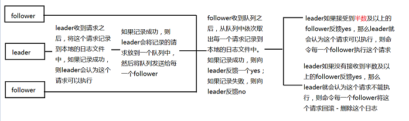

- ## ZooKeeper 选举机制
    - > 数据恢复阶段: 
        >> - 当ZooKeeper 节点启动之后，每一个ZooKeeper 服务器都会找到当前节点中最大的事务ID(mzxid或pzxid);
    - > 选举阶段
        >> - 每一个节点都会选举自己当leader，并且将当前节点的选举信息发送给其他节点;
        >>> - 选举信息: 
        >>>> - 节点的最大事务ID;
        >>>> - 选举编号/节点编号 - myid
        >>>> - 逻辑时钟值 - 确定所有的节点选举是在同一轮上
        >> - 比较原则:
        >>> - 先比较两个节点的最大事务ID，谁的事务ID 大谁就胜出
        >>> - 如果两个节点的事务ID 一致，则比较两个节点的myid。谁的myid 大谁就胜出。
        >> - 如果某个节点胜出了一半及以上的节点，那么这个节点就会成为leader
        >> - 节点状态: 
        >>> - looking - 选举状态
        >>> - follower - 追随者
        >>> - leader - 领导者
        >>> - abserver - 观察者
        >> - 过半选举，以配置数量为准，不管是否挂了几个。
    - > 如果集群中确定了leader,那么后续添加的节点的事务ID或者MYID 无论是多少，都只能成为follower
    - > 集群中的节点最好是奇数个，奇数个节点能够有效的进行选举，也能够防止脑裂

- ## ZAB 协议
    - > ZAB 是专门为ZooKeeper 设计的协议，基于2PC 算法和PAXOS 来进行的设计
    - > 两部分: 原子广播 和 崩溃恢复(leader 挂了之后选举出一个新leader)
        - ### 原子广播
        - > 解决的是信息的共享
        - > 原子广播的流程
            >> 
            >> - leader 收到请求之后会首先将这个请求写到日志文件中，如果写失败，则拒绝执行。
            >> - 如果写成功了，那么它会把这个请求放到一个队列中，然后发送给所有的follower。
            >> - follower 们拿到这个队列也会将请求写到自己的日志文件中，如果成功返回YES，否则返回NO。
            >> - leader 如果收到半数以上的反馈是YES，那么它就会认为这个请求可以执行，并且执行它，同时给每一个follower 发送执行此请求的决定。
            >> - leader 如果在配置时间上没有收到半数以上的反馈是YES，那么它会认为此请求不能执行，同时给每一个follower 发送取消执行此请求的决定。
        - > 如果一个节点新连入集群，这个节点会找这个集群中的leader，比较两者的最大事务ID，然后LEADER 会将新节点所缺的请求放入一个队列中发给新节点，新节点收到队列 之后再从队列中依次取出，
        - ### 崩溃恢复
        - > 当leader出现的宕机或者从集群中离开的时候，整个集群要选举出一个新的leader，这个过程就称之为崩溃恢复的过程
        - > 在崩溃恢复过程中，为了防止集群中出现多个leader共同"执政"的情况，在选举leader的时候会给leader一个编号(epochid)，epochid是全局递增的。当节点被选为leader的时候，它会将它的epochid分发给每一个follower
            >> - 这个epochid 的值存放在`dataDir` 所配置的目录下面的 `version-2/acceptedEpoch` 文件中。
            >> - 每进行一次选举这个值就会+1
            >> - 它的作用主要是防止一些leader 脱离集群之后，然后再次连入集群导致脑裂现象。
            >> - 恢复的leader 会与当前的leader 进行epochid 的值的比较，谁的大谁做leader
        - > 在集群中，事务id实际上是64位二进制，其中高32位表示epochid，低32位才是真正的事务id

- ## 扩展协议
    - ### 2PC - Two Phase Commit
    - > 2阶段提交，将请求的提交过程分为2个阶段
        >> - 核心思想：一票否决
    - > 确认阶段
        >> - 协调者收到请求之后会将请求去分发给每一个参与者，等待每一个参与者反馈的信息
    - > 执行/中止阶段
        >> - 如果协调者收到所有参与者的消息，并且所有消息都是YES，则协调者就会命令每一个参与者执行这个请求
        >> - 如果协调者收到了一个及以上的NO，或者协调者没有收到全部参与者的YES，则协调者认为这个请求不能执行，命令所有的参与者中止执行这个请求。
    - ### paxos 算法
        >> - PAXOS 用于在不稳定的集群中有效的决定某个请求的执行的场景。