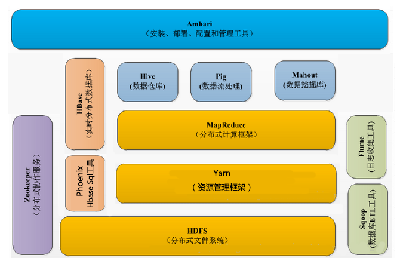

- ## Haddop 生态系统圈
    > 

    > 
<mark>图示</mark>

    > 
    >> - 
    > 

    > 

- ## 安装模式
    - > 单机模式(<mark>没什么用</mark>)
        >> 只能启用mapReduce,不能启用HDFS 以及Yarn
    - > 伪分布式
        >> 在一台机器来模拟集群，启动Hadoop的所有进程
    - > 全分布式
        >> 多台机器来搭建

- ## Hadoop 简介
    - > 适用于进行离线分析的框架

- ## Hadoop 模块
    - > Hadoop Common: 
        >> - The common utilities that support the other Hadoop modules.
        >> - 基本模块
    - > Hadoop Distributed File System (HDFS™): 
        >> - A distributed file system that provides high-throughput access to application data.
        >> - 用于存储数据
    - > Hadoop YARN: 
        >> - A framework for job scheduling and cluster resource management.
        >> - 用于任务调度和资源管理
    - > Hadoop MapReduce: 
        >> - A YARN-based system for parallel processing of large data sets.
        >> - 用于并行的分布式计算
    - > Hadoop Ozone: 
        >> - An object store for Hadoop.
        >> - 用于对象的存储
    - > Hadoop Submarine: 
        >> - A machine learning engine for Hadoop.
        >> - 用于机器学习的引擎

- ## Hadoop 版本
    - > Hadoop 1.0: 只包含了HDFS和MapReduce
    - > Hadoop 2.0: 包含了HDFS、MapReduce 以及Yarn。不兼容1.0
    - > Hadoop 3.0: 兼容2.0, 新添了Ozone, Submarine

- ## 相关工程项目(Related projects)
    - > Ambari™: 
        >> - A web-based tool for provisioning, managing, and monitoring Apache Hadoop clusters which includes support for Hadoop HDFS, Hadoop MapReduce, Hive, HCatalog, HBase, ZooKeeper, Oozie, Pig and Sqoop. Ambari also provides a dashboard for viewing cluster health such as heatmaps and ability to view MapReduce, Pig and Hive applications visually alongwith features to diagnose their performance characteristics in a user-friendly manner.
    - > Avro™: A data serialization system.
    - > Cassandra™: A scalable multi-master database with no single points of failure.
    - > Chukwa™: A data collection system for managing large distributed systems.
    - > HBase™: A scalable, distributed database that supports structured data storage for large tables.
    - > Hive™: A data warehouse infrastructure that provides data summarization and ad hoc querying.
    - > Mahout™: A Scalable machine learning and data mining library.
    - > Pig™: A high-level data-flow language and execution framework for parallel computation.
    - > Spark™: A fast and general compute engine for Hadoop data. Spark provides a simple and expressive programming model that supports a wide range of applications, including ETL, machine learning, stream processing, and graph computation.
    - > Tez™: A generalized data-flow programming framework, built on Hadoop YARN, which provides a powerful and flexible engine to execute an arbitrary DAG of tasks to process data for both batch and interactive use-cases. Tez is being adopted by Hive™, Pig™ and other frameworks in the Hadoop ecosystem, and also by other commercial software (e.g. ETL tools), to replace Hadoop™ MapReduce as the underlying execution engine.
    - > ZooKeeper™: A high-performance coordination service for distributed applications.

