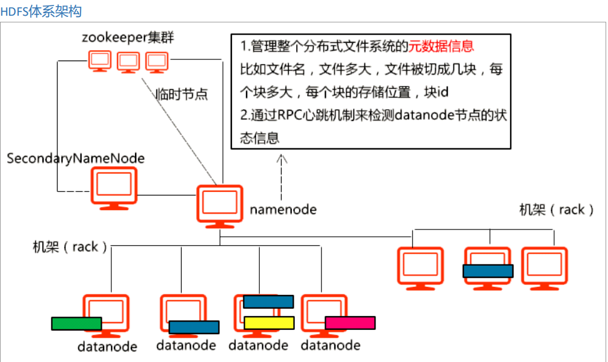

- ## HDFS 体系结构
    > 

    > 
<mark>HDFS结构图示</mark>

    > 
    > 
    > 

    > 

- ## HDFS
    - > 是Hadoop 的组件，用于完成分布式存储
    - > 全称为`Hadoop Distributed File System` ，Hadoop分布式文件存储系统。

- ## HDFS 特点
    - > 存储超大文件 - 切块
    - > 能够快速的应对和检测故障 - 心跳

- ## 存储文件
    - > 在存储数据时会将数据进行切分，切出来的每一个块称之为Block
    - > 包含两类主要的节点：NameNode 和DataNode
        > - DataNode 负责存储具体数据，NameNode负责记录数据以及管理DataNode
    - > 在HDFS 中，为了保证数据的完整性，将每一个Block 进行备份，每一个备份称之为一个复本。默认的复本数量为3 (1 + 2)。

- ## Block
    - > 一个数据埠，是HDFS 中数据存储的基本单位
    - > 每一个文件上传到HDFS 中，都会切成一个或者多个Block
    - > 在Hadoop1.0 中，每一个Block 大小是64M，在haddop2.0 中，每一个Block 大小是128M。
        >> - 128 M 是指的是最大块大小
    - > 如果一个数据块不足128M，那么这个数据本身是多大就占用多大的空间
    - > 切块的意义
        > - 能够存储超大文件
        > - 快速备份
    - > 当对文件进行切块的时候，会为它分配一个全局递增的ID

- ## DataNode
    - > 用于进行数据的存储
    - > 以Block 的形式存储
    - > DataNode 会每隔3s 给NameNode 发送一次心跳

- ## NameNode
    - > 核心节点
        > - 在1.0 中只能存在一个。在2.0 中最多也只能存在2 个
        > - 配置在`core-site.xml` 中
    - > 负责管理DataNode 和存储元数据
    - > 元数据包含
        > - 文件的存放路径
        > - 文件的切块数量
        > - 块的复本数量
        > - 复本与DataNode 的关系
    - > 元数据维系在内存以及磁盘中
        > - 元数据持久化的目录路径，是由`core-site.xml`的`hadoop.tmp.dir`属性来决定的。此参数如果不配置，默认是放在/tmp，所以必须要配。
    - > 元数据的存储文件是 edits 和 fsimage
        > - 这两个文件的查看路径：hadoop-2.7.1/tmp/dfs/name/current
        > - Edits文件 => 存储HDFS的操作记录,记录写操作
        > - Fsimage文件 => 存储是整个HDFS的状态（相当于快照文件）
        >> - 记录元数据，非实时记录
        > - edits 文件和fsimage 文件进行合并的条件
        >> - 时间维度：与上一次合并相距一定时间之后进行全并。
        >>> - `core-site.xml` 中的`fs.checkpoint.period` 默认值是: 3600s
        >> - 空间维度: 当edits 达到指定大小时合并。
        >>> - `core-site.xml` 中`fs.checkpoint.size` 默认是64M
        >> - 在NameNode 重启时也会触发edits 和fsimage 文件的更新合并
        >> - 手动合并
        >>> - `hadoop dfsadmin -rollEdits`
        > - 写请求流程
        >> - 当NameNode 收到写请求的时候，会先将这个请求记录到edits中，
        >> - 如果记录成功再更改内存中的元数据，最后给客户端返回ack表示操作成功。
        >> - 这个过程中并不涉及fsimage 文件的修改
    - > NameNode 通过心跳机制来管理DataNode
        > - 心跳机制的默认时间是3秒，默认心跳无响应时间为10 分钟
        > - NameNode 作为服务端，DataNode 作为客户端连接
        > - 心跳信号包含：当前节点的状态(表示存活)，以及当前节点存储的Block 信息(若DataNode 中某一个Block 块丢失，NameNode 会从这个Block中得知，然后让其从其他节点中拷贝一份，以保证其存储的Block 数据的正确)
        > - 若某一个DataNode 长时间没有心跳响应，则NameNode 会认为它lost ，此时NameNode 会将其存放的Block 再备份到当前存活的其他DataNode 上，以保证Block 的复本数量
    - > 当NameNode 重新启动的时候
        > - 触发edits 和fsImage 之间的更新合并，
        > - 然后将fsimage 中的元数据加载到内存。
        > - 等待DataNode 的心跳
        >> - 校验数据的总量是否正确
        > - 这个过程称之为安全模式
    - > 当启动HDFS 的时候，如果发现其处在安全模式，需要等待一会儿。如果校验成功它会自动退出安全模式。
        > - HDFS 处于安全模式时，不对外提供服务。
        > - 若HDFS 一直处在安全模式中，说明有数据丢失。此时可以使用如下命令强制退出安全模式
        >> - `hadoop dfsadmin -safemode leave`

- ## 复本放置策略
    - > 默认复本数量是3
        >> - 第一个复本
        >>> - 如果是从集群内部上传，哪个DataNode 上传，则每一个复本就放在DataNode 上
        >>> - 如果是从外部上传，则找一个比较空闲的节点存储第一个复本
        >> - 第二个复本
        >>> - 放在和第一个复本不同机架的节点上
        >> - 第三个复本
        >>> - 放在和第二个复本相同机架的不同节点上(相同机架传输更快)
        >> - 更多的复本：挑选相对空闲的节点进行存储

- ## 机架感知策略
    - > 在Hadoop 中，所谓的机架实际上是一个映射，是一个逻辑机架
        > - 可以将不同的主机映射到同一个机架上
        > - 可以将不同的物理机架上的节点映射到同一个逻辑机架上
        > - 实际开发中，一般会将同一个物理机架上的节点放在同一个逻辑机架上面。

- ## 操作命令
    - > `hadoop fs -put a.txt /`
        >> 上传
    - > `hadoop fs -get /a.txt`
        >> 下载
    - > `hadoop fs -ls /`
        >> 查看
    - > `hadoop fs -lsr /`
        >> 递归查看
    - > 

- ## 回收站策略
    - > 在HDFS 中，当删除文件或者目录的时候是立即删除，这是因为Hadoop 中回收站策略默认是不开启。
        >> - 配置`core-site.xml`
        >> - 移动到回收站，在指定时间内没有被还原，则会被清除

- ## SecondaryNameNode
    - > 既不管理DataNode 也不负责存储元数据，并不是NameNode 的热备份，在早期版本中只是辅助NameNode 进行元数据的合并 -edits 和fsimage 在1.0 中合并时发生在SecondaryNameNode 上，但是在Hadoop 的2.0 的完全分布式中，舍弃了SecondaryNameNode,  为了保证NameNode 的高可用，通过舍弃SecondaryNameNode 的方式来设置2个NameNode

- ## 扩展
    - > Federation HDFS - 联邦HDFS
    - > 分流 NameNode

