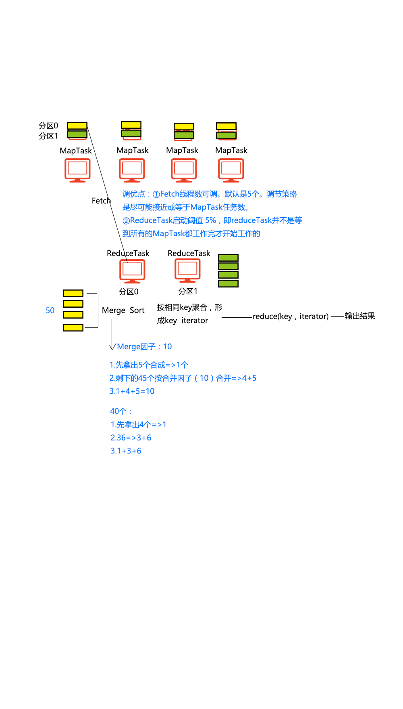

- ##  Shuffle (洗牌)
    > 

    > 
<mark>Shuffle 流程</mark>

    > 
    > 
    > 

    > 

--- 

- > 切片
    > - 当提交MR程序之后要对文件进行切片。
    > - 如果文件不可切(例如压缩文件)，此时将整个文件作为一个切片
    > - 如果文件可切，那么默认切片和切块是一样大的
    >> - 如果最后的数据部分(`最后剩余的数据/splitsize<1.1`)，则最后的数据整体作为一个切片来进行处理；
    > - 每一个切片会分配到一个MapTask。
    >> - 默认情况下，每一个MapTask的处理方式是对切片数据进行按行读取。可以自行设置分片数据的读取方式(通过InputStream)

- ### shuffle-map 阶段
    - > shuffle-map流程
        > 

        > 
<mark>Shuffle Map 流程</mark>

        > 
        >> 
        > 

        > 
    - > spill(溢写)
        > - MapTask 内存缓冲区
        >> - 每一个MapTask 会有一个自己的缓冲区，这个缓冲区的大小默认是100MB。
        >> - 它是一个环型缓冲区.
        >> - 数据在缓冲区中是分区(partition)并且排序(sort)的。
        >> - 如果指定了Combiner，在缓冲区中还会进行合并
        > - 阈值
        >> - 当MapTask 的缓冲区中的数据达到一个阈值(默认是80%)时，MapTask 会启动溢写。
        >> - MapTask 会将这些数据写到一个(溢写)文件中
        >> - 这个溢写文件中的数据是分好区且排好序的文件。
        > - 最后一次溢写之后，如果依然有数据存在缓冲区中，MapTask 会将缓冲区中的数据冲刷到最后一个溢写文件中
        > - 如果数据量较大，就会多次溢写，从而产生多个溢写文件。
    - > merge
        > - 如果产生了多个溢写文件，那么在数据处理完成之后，MapTask会将它产生的所有的溢写文件合并(merge)成一个文件，产生最后的结果文件
        > - merge 仅仅是对Spill 文件进行拼接。
        > - 但是如果Spill 文件的数量 >= 3 个时，那么在merge 的过程中会自动进行Combiner
    - ### <mark>知识点</mark>: 
        - > 溢写过程不一定发生，在处理完当前切片的数据之后，将缓冲区中的数据直接写到最后的结果文件中
        - > 切片的大小不能决定溢写次数
        - > 在默认情况下，溢写文件的大小不一定是80M
        - > 缓冲区本质上是环形的字节数组
        - > 环形缓冲区的好处在于能够避免重新寻址 - 重新找开头的地址
        - > 阈值的作用：为了防止往缓冲区写结果的时候产生阻塞
- ### shuffle-reduce 阶段
    - > Shuffe Reduce 流程
        > 

        > 
<mark>Shuffle Reduce 流程</mark>

        > 
        >> 
        > 

        > 
    - > Reduce fetch 线程
        > - fetch 线程默认情况下是5 个
        > - fetch线程通过http请求来抓取数据
        > - 当MapTask 完成比例达到阈值(默认情况下是5%)，那么Reduce 将会开启fetch 线程到MapTask 中去抓取数据
        > - fetch 只会抓取自己对应分区中的数据。
    - > 合并
        > - reqduce 会将抓取来的数据进行全并，默认的合并因子是10 (即10 个文件合一个)
        > - 在合并的过程中Reduce 会将结果进行排序
    - > 分组
        > - Reduce 会将相同的键所对应的值放入一个List中，然后利用这个List产生一个Iterable对象，交给Reduce来执行，这个过程称之为分组（group）
    - > 每一个键调用一次reduce方法，将reduce方法的结果写到HDFS上

- ## Shuffle调优
	- ### Map端：
		- > 调大缓冲区，实际开发中一般是将缓冲区设置为250~400M之间（建议）
		- > 调大阈值，可以减少Spill的次数，但同时增加线程的阻塞的概率（不建议）
		- > 增加Combine过程（建议）
		- > 将结果进行压缩，好处在于减少MapTask和ReduceTask之间传输的数据量，减少网络传输的时间，同时ReduceTask这一端还需要将数据解压
            > - 这种方案实际上是网络资源的取舍问题
	- ### Reduce端：
		- > 增多fetch线程的数量（建议）
		- > 增大merge因子
        - > 减小ReduceTask的阈值（不建议）

