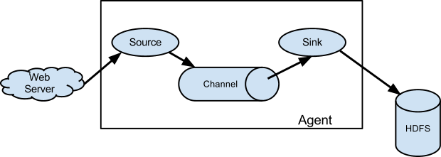

- ## Flume 原理
    > 

    > 
<mark>Flume原理图</mark>

    >
    >> 
    >
    > 

    >

- ## 基本概念
    - > Event: 
        > - 在Flume 中，将它的每一个日志封装成一个Event 对象。也就意味着在Flume中传输的Event 对象。Event 对象展现形式是一个json 串，这个json 串分为两个部分: headers 和body
    - > Agent: 
        - > Source  数据源
            > - 可以通过路由将数据分发到不同的channel 中
            > - 它也可以将数据通过路由将数据复制到不同的channel 中
            > - 以及拦截一些数据，为这个数据封装一些其他属性进行一些简单的处理
            >> - 比如在这个数据的event 对象中，添加一些header，下游可能通过这些标记来区分数据
        - > Channel  数据缓冲区
            > - channel 就是一个缓冲区
            > - 一个channel 对应一个sink
        - > Sink  数据流出目的地
            > - 连接下游，从channel 中取数据，发往下游

- ## 配置文件
    - > 文件名和文件路径不受限制，启用的时候使用命令会指定配置文件
    - > 利用avro 可以实现多级流动以及扇入扇出

- 启动
    - > 命令 `sh flume-ng agent -n a1 -c ../conf/ -f ../data/basic.conf -Dflume.root.logger=INFO,console`
        > - agent  运行一个Flume Agent
        > -  -n a1 指定agent 的别名a1，这里要和配置文件中的名字一致
        > - -c ../conf/   指定一些模板配置文件，这里用的是自带的没有做任何修改
        > - -f ../data/basic.conf  指定我们添加的agent 的配置文件
        > - -Dflume.root.logger=INFO,console  设置一个JAVA 系统属性值，这个是常见值。一般都固定是这样写了

- ## nc 模拟发TCP 数据(netcat 类型)
    - > `nc 192.168.220.146 8090`

- ## avro 
    - > 开启接收avro 数据的服务器
        > - `../bin/flume-ng agent -n a1 -c ../conf/ -f ./avrosource.conf -Dflume.root.logger=INFO,console`
    - > 模拟客户端发avro 序列化数据
        > - `sh flume-ng avro-client -H 0.0.0.0 -p 8070 -F /root/software/apache-flume-1.6.0-bin/data/a.txt -c ./`
        > - a.txt 文件中可以是任意数据，这个数据将直接被发到服务器

- ## curl 模拟HTTP 请求
    - > `curl -X POST -d '[{"headers":{"class":"big1812","classroom":"502"},"body":"hello big1812"}]'  http://0.0.0.0:8070`

