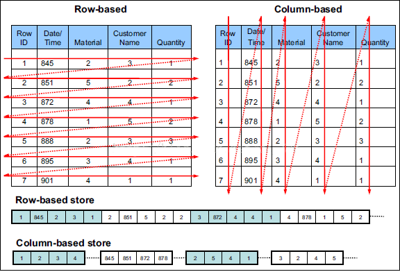

- # HBase 介绍
    - > HBase是一个**分布式的、面向列**的开源数据库，该技术来源于 Fay Chang 所撰写的Google论文《Bigtable》一个结构化数据的分布式存储系统"。就像Bigtable利用了Google文件系统(File System)所提供的分布式数据存储一样，HBase在Hadoop之上提供了类似于Bigtable的能力（**低延迟的数据查询能力**）。HBase是Apache的Hadoop项目的子项目。HBase不同于一般的关系数据库，Hbase同BigTable一样，都是NoSQL数据库，即非关系型数据库，此外，HBase和BigTable一样，是基于列的而不是基于行的模式。

- ## 行存储 VS 列存储
    
    - ### 行存储
        - > 数据连续
        - > Mysql Oracle
        - > 弥补读取劣势：物化索引
            > - 物化索引也是需要耗费CPU和时间的，
            > - 所以针对MYSQL ORACLE 等表建索引时，一般是为读场景比较多的场景建索引。

    - ### 列存储
        - > 数据间断
        - > BitTable HBase
        - > 弥补写入劣势：引入列族
            > - 列族不易过多，但是列族下的列可以多
            > - 将相关一起被查询的多个列放在一个列族

    - ### 行存储与列存储对比
        - > 存储写入时，行存储性能更高
            > - 因为行存储的写入是连续的，避免了碰头的多次调度和寻道时间
        - > 海量数据读取时，列存储性能更高
            > - 列存储在海量数据查询时不会产生冗余列
            > - 列存储的每一列数据都是同质(相同类型)的，所以避免和节省了数据类型转换的CPU消耗
            > - 可以采用更高效的压缩算法，比如增量压缩算法，二进制压缩算法
            > - 基于列存储，表数据可以很稀疏。即节省磁盘空间

- # HBase 与Hive 的区别
1. HBase 是非关系型数据库，Hive 是基于hadoop 的数仓工具
2. Hive 必须基于Hadoop;HBase 可以不基于Hadoop, HBase 可以脱离Hadoop 存在
3. HBase 只提供了基本的CURD 的能力；Hive 中提供了大量的函数允许对数据进行

- # 行键
    - > 行键唯一

- # HBase
    - > 特点
        > - 创建表时，需要指定表名，并且需要指定有几个列族，列族数不宜过多，一般2到3个
        > - 插入表数据时，需要指定表名，行键，列族:列名，值

# 技术细节
- # HRegion
    - > 每一个Table中，半一行或者多行作为一个HRegion 进行处理
    - > 一个HRegion 由一个或者多个HStore 构成
    - > 每一个HStore 包含一个或者多个MemStore以及0 个或者多个StoreFile
    - > 每一个HRegion 都会分布在不同的节点(HRegionServer)上
    - > 每一个hRegionServer, 按照HBase 的设计大概能管理1000 个HRegion

- # HMaster
    - > HMaster 是HBase 中的管理节点
    - > HMaster 不存在单点故障问题。
        > - 可以启动多个HMaster
        > - 按照启动顺序，先启动的将会成为Active 状态，其它的将会成为back-up 状态
    - > HMaster 在启动之后会自动在ZooKeeper 上注册一个临时节点 /hbase/master
        > - back-up HMaster 在启动之后会自动在ZooKeeper 上注册一个临时节点/hbase/backup-masters
    - > ZooKeeper 通过心跳机制监控HMaseter(HMaster 定期向ZooKeeper 来发信号，维护这个临时节点，心跳时间默认是180s)
    - > 如果 active HMaster 宕机，则ZooKeeper 自动触发选举过程，从backup-master 选出一个节点成为active HMaster

- # ZooKeeper
    - > 在HBase 中作为协调者来使用
    - > 当HBase 启动的时候, HMaster 和HRegionServer 都会到ZooKeeper 来注册一个临时节点
        > - 注册的都是临时节点
        > - HMaster 注册的节点是 /hbase/master
        > - HRegionServer 注册的节点是 /hbase/rs/XXX
    - > HMaster 并不是直接监控HRegionServer，而是通过ZooKeeper 监控
        > - HRegionServer 会定时向ZooKeeper 发送心跳
        > - HMaster 会监控 /hbase/rs/ 节点
        > - 如果发现 /hbase/rs/ 节点下的子节点少了，则HMaster 要将这个节点上的数据备份到其他节点上。

- # HRegionServer
    - > 用于存储和管理HRegion
        > - 每一个HRegionServer 都可以管理多个HRegion
    - > HRegionServer  由WAL、Block Cache 以及HRegion 构成
        > - WAL - Write Ahead Log (HLog)
        >> - 在HRegionServer 中用于记录操作
        >> - 当发生写操作(put、deleteall) 的时候，这些操作先记录到WAL中
        >> - 如果 WAL 中记录成功，则再将这个操作更新到MemStore 中；
        >> - 如果MemStore 满了会将数据flush 到StorFile 中
        >> - 这种设计的目的是为了崩溃恢复
        >> - WAL 文件达到限度之后，会自动进行roll 过程，产生一个新的WAL 文件，后续的操作会记录到新的WAL 文件，但是不会立即删除旧的WAL 文件
        >> - 如果当数据持久化到Storefile中，这个时候可以删除旧的WAL
        >> - WAL 是存在在HDFS上，是利用了Hadoop 中提供的sequence file 文件的格式来存储的
        >>> - sequence file 是二进制的键值结构的文件
        >> - WAL 在HRegionServer 中只有一个，在早期的HBase 版本中，WAL 只能串行操作；从0.94 版本开始，对WAL 采取了管道技术使得它可以进行并行操作
        > - Block Cache
        >> - 在HRegionServer 中只有1 个，是一个读缓存
        >> - 当产生读操作(get、scan)的时候，会将从HRegion 读取到的数据缓存到这个Block Cache 中
