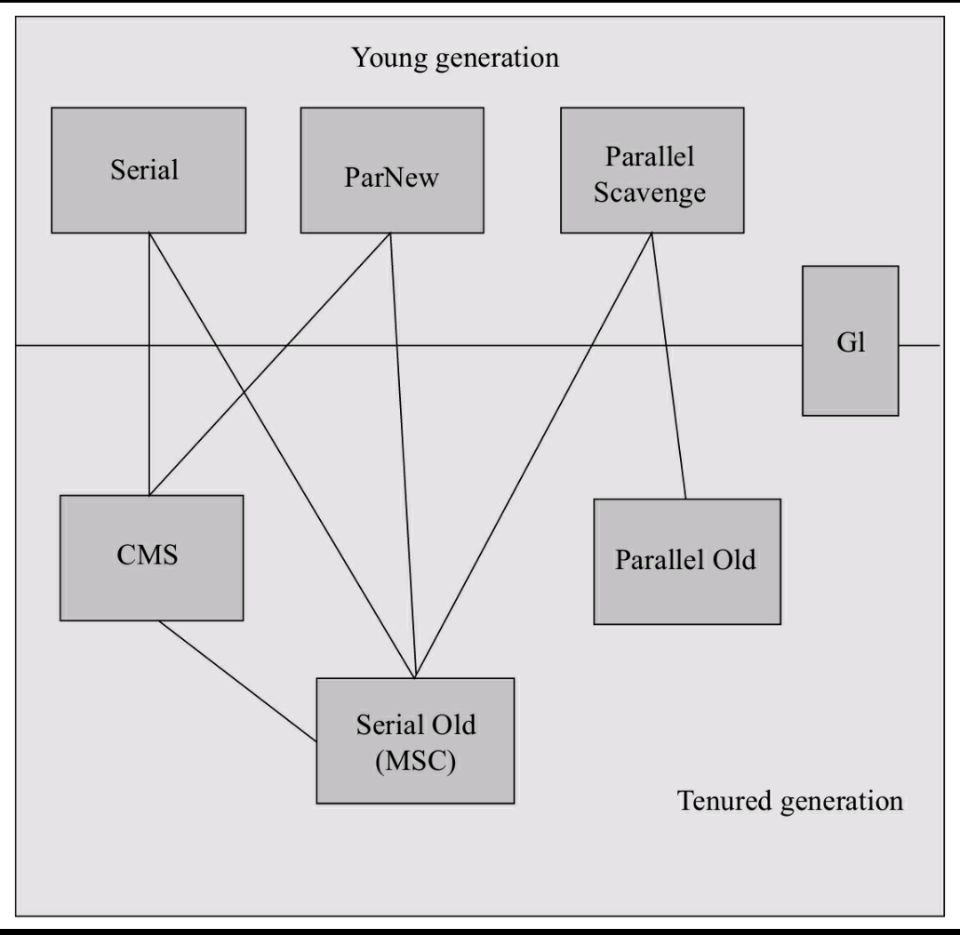

# GC 回收机制与算法
- ## 算法
    - ### 引用计数算法
    - ### 可达性分析算法
- ## 回收机制
    - ### 标记清除
    - ### 标记整理
    - ### 拷贝(copying)

# GC 回收器
- ## 图示
    > 

    > 
<mark>图示</mark>

    > 
    > 
    > 

    > 

- ## 新生代
    - > Serial
    - > ParNew
    - > Parallel Scavenge
- ## 老生代
    - > CMS
    - > Serial Old(MSC)
    - > Parallel Old
- ## 全生代
    - > G1

- ## Full GC
    - ### 触发条件
        - > 只有找不到全空区域块时，才会发生Full GC
- ## Eden、Survivor Spac、Old Generatio
    - ### Eden
        - > 一个区域块的大小范围是1~32(MB)
            > - 可通过参数调节

