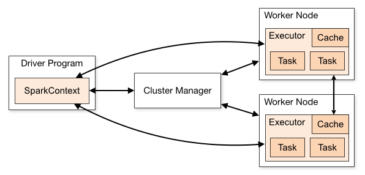
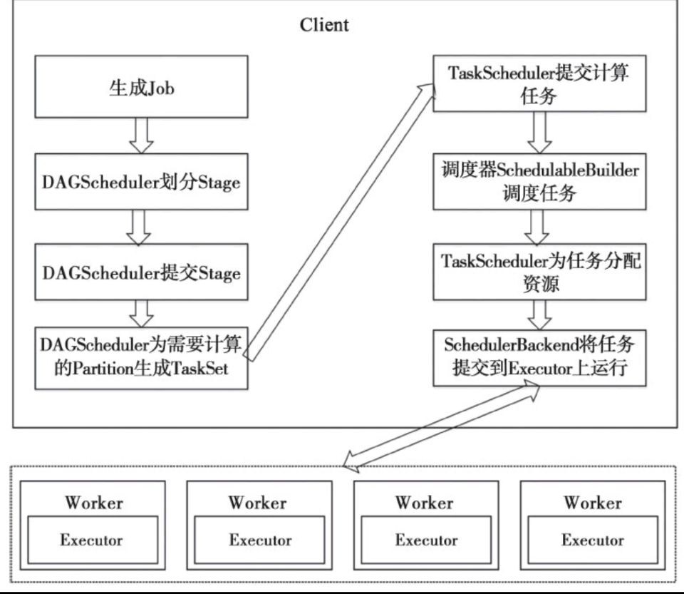
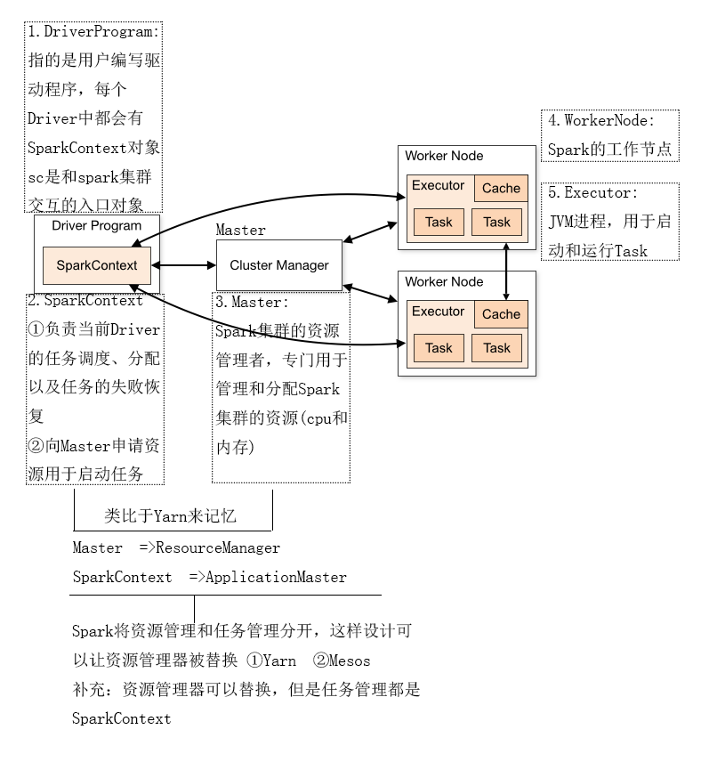

# Spark 架构模块
- ## 模块图
    > 

    > 
    >> 
    > 

- ## Claster Master 集群管理器
    - > 对应图中Claster Master 进程
        > - 集群管理器负责集群的资源高度
        > - 比如为Worker Node 分配CPU、内存等资源
        > - 并实时监控Worker 的资源使用情况。
    - > Claster Master 只负责资源管理高度，而任务的分配和结果处理它不管。
        > - 所以，这个进程可以被Yarn 替换

- ## Driver Program
    - > 用户编写的Spark 程序称为一个Driver Program。
        > - 每个Driver Program 仅包含一个集群环境的SparkContext 对象。
        > - 程序的执行从Driver 程序开始，最后回到Driver 程序。

- ## SparkContext 对象
    >> 

    >> 
    >>> 
    >> 

    >> 

    >>
    >>> 
    >> 

    >> 
    - > 可以配置允许同时多个SparkContext 对象
        >
        >       // 是否允许存在多个SparkContext，默认是false
        >       // If true, log warnings instead of throwing exceptions when multiple SparkContexts are active
        >       private val allowMultipleContexts: Boolean =
        >         config.getBoolean("spark.driver.allowMultipleContexts", false)
    - > 每一个Driver Program 里都有一个SparkContext 对象
    - > 它的职责如下
        > - SparkContext 对象联系Cluster Manager(集群管理器), 让Cluster Manager 为 Worker Node 分配CPU、内存等资源。
        > - 与Executor 进程交互，负责任务的调度分配。
    - > DAGScheduler 模块
        > - 将一个DAG划分为多个Stage
        >> - 将多个窄依赖合并为一个Task 形成一个Task 集合。这一组集合就是一个Stage
        > - 把Task Set 交给TaskScheduler模块。
    - > TaskScheduler 模块
        > - 为属主（SparkContext）调度任务
        > - 主要是为Task 模块分配计算资源，并向Master 申请资源 
        > - 将Task 提交到Worker 进行任务的执行
        > - 同时还会监控Task 在Worker 上面的执行情况，当失败了之后会再次提交，然后再次运行。
    - > SchedulerBackend
        > - 是一个trait，作用是分配当前可用的资源，具体就是向当前等待分配计算资源的Task分配计算资源（即Executor），并且在分配的Executor上启动Task，完成计算的调度过程。

- ## Worker Node
    - > Worker 节点，集群上的计算节点，对应一台物理机

- ## Worker 进程
    - > 用于与Master 进程交互向Master 注册和汇报自身节点的资源使用情况，并管理和启动Executor 进程

- ## Executor
    - > Executor 是一个进程，它会为每一个Task 开启一个线程来运行。
    - > 负责运行Task 计算任务，并将计算结果回传到Driver 中。

- ## Task 
    - > 在执行器上执行的最小单元
        > - 比如RDD Transformation 操作时对RDD 内每个分区的计算都会对应一个Task

# Spark 的调度
- ## 调度
    - > 示例图
        >> 

        >> 
<mark>示例图</mark>

        >> 
        >>> 
        >> 

        >> 

- ## 调度流程
    - > 示例图
        >> 

        >> 
<mark>示例图1</mark>

        >> 
        >>> 
        >> 

        >> 
        >> 

        >>
        >> 
<mark>示例图2</mark>

        >> 
        >>> 
        >> 

        >> 
    - > 流程解析
        > - RDD Objects 可以理解为用户实际代码中创建的RDD，这些代码逻辑上组成了一个DAG
        >> - 也就是一个SparkContext 中的处理逻辑
        >> - 这些逻辑形成一个DAG(有向无环图)
        > - DAGScheduler 主要负责分析依赖关系，然后将DAG 划分为不同的Stage(阶段)
        >> - 其中每个Stage 由一组TaskSet 组成
        >> - 这些Task 执行逻辑完全相同，只是作用于不同的数据源
        >> - DAGScheduler 将TAG 划分完成之后，会将Stage 中的TaskSet 提交到TaskScheduler
        > - TaskScheduler 向ClusterManager 申请计算资源，并提交到对应的Worker 节点去执行相应的逻辑
        >> - 在Worker 中计算的结果会回传到Driver 或者保存到本地磁盘
        > - SchedulerBackend 这是一个类对象，它会分配当前的可用资源

- ## 调度模块
    - > Driver Program
        > - 每个Driver 都有一个SpackContext(sc)
        >> - sc 负责与Executor 交互，完成任务的分配的高度

# SparkContext 核心类对象
## 功能和作用
- ### SparkContext 最主要的作用有三个
    - > 初始化SparkEnv 对象
    - > 初始化并启动三个调度模块
        > - DAGScheduler 
        >> - 主要负责分析依赖关系，然后将DAG 划分为不同的tage
        >> - 其中每个Stage 由可以并发执行的一组Task 构成
        >> - 这些Task 的执行逻辑完全相同，只是作用于不同的数据。
        > - TaskScheduler
        >> - 为SparkContext 调度任务
        >> - 即从DAG 接收不同的Stage ，并且向集群提交这些任务，并为执行特别慢的任务启动备份任务
        > - SchedulerBackEnd
        >> - 依据当前任务申请到的可用资源，将Task 在Executor 进程中启动并执行，完成计算的调度过程。
    - > 建立各个工作节点的心中机制，用于检测和最监控
## 其它
- ### SparkContext 对象的数量
    - > 默认情况下SparkContext 只能有一个对象，若创建多个则会报错
    - > 如果想要创建多个，需要添加配置

# SparkEnv 环境参数对象
## 功能和作用
- ### 介绍
    - > local 模式
        > - 在此模式下Driver 会创建Executor, 在Standalone 部署模式下，Worker 上创建Executor。
        > - 所以SparkEnv 存在于Spark 任务调度时的每个Executor 中。
        > - SparkEnv 中的环境信息是对一个job 中所有的Task都是可见且一致的。以确保运行的环境一致。
## SparkEnv 各组件依次构造
- ### SecurityManager
    - > 安全管理器
- ### RpcEnv
    - > RPC通信方式
- ### ShuffleManager
    - > 负责管理本地及远程的Block数据的shuffle操作
- ### MapOutPutTracker
    - > 用于跟踪Shuffle Map Task任务的输出状态
- ### MemoryManager
    - > 内存管理器
- ### NettyBlockTransferService
    - > 块传输服务
        > - 使用Netty提供的网络应用框架
        > - 提供web服务及客户端
        > - 获取远程节点上Block的集合
        > - 底层的fetchBlocks方法用于获取远程shuffle文件中的数据
- ### BlockManagerMaster
    - > 负责对BlockManager的管理和协调
- ### BlockManager
    - > 块管理器
- ### BroadcastManager
    - > 广播管理器
- ### CacheManager
    - > 缓存管理器
- ### ListenerBus
    - > 监听总线
- ### MetricsSystem
    - > 检测系统

## SparkEnv 中的各个组件介绍
### 内存管理器 MemoryManager
#### 内存模块
- ### 说明
    - > 每个Executor进程都有一个MemoryManager。
- ### storageMemory（存储内存）
    - > 用来缓存rdd，unroll partition，direct task result、广播变量等
- ### executionMemory（执行内存）
    - > 用于shuffle、join、sort、aggregation 计算中的缓存
- ### 其他内存
    - > 除了这两者以外的内存都是预留给系统的。

#### 两套管理方案
- ### StaticMemoryManager 静态管理(旧)
    - > 拥有的内存是独享的不可相互借用
        > - 所以在其中一方内存充足，但另一方内存不足但又不能借用的情况下会造成资源的浪费
- ### UnifiedMemoryManager 动态管理(新)
    - > 统一管理，初始状态是内存各占一半，相互之间可以借用
        > - 其中一方内存不足时可以向对方借用，对内存资源进行合理有效的利用，提高了整体资源的利用率。

#### 参数配置
- ### 对应参数
    - > `spark.memory.useLegacyMode`
        > - 默认值：`UnifiedMemoryManager` 动态管理机制

