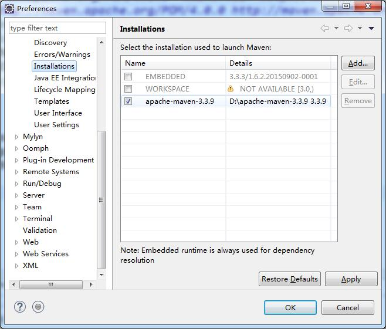

- Maven 服务的URL： 
    > http://maven.aliyun.com/
    > https://mvnrepository.com/tags/scala  搜索仓库

1. Maven 仓库的配置
    > 配置文件: `D:\apache-maven-3.3.9\conf\settings.xml`  
    > aliyun 仓库用于搜索的网络地址 [aliyun maven search](https://mvnrepository.com/repos/aliyun-releases) 

        <localRepository>D:\apache-maven-3.3.9\maven-repository\</localRepository>

        <mirrors>
            <mirror>
            <id>aliyun</id>
            <mirrorOf>aliyun Maven</mirrorOf>
            <name>*</name>
            <url>http://maven.aliyun.com/nexus/content/groups/public/</url>
            </mirror>
        </mirrors>

2. eclipse 中创建Maven 项目

    

3. eclipse 中配置 Maven 项目

    > 1. windows --> preferences  -->  maven  --> installations  --> Add... 
    
    > 2. windows --> preferences  -->  maven  --> User Settings  --> `GlobalSettings(open file):` --> Browse...  --> `D:\apache-maven-3.3.9\conf\settings.xml`
    

4. maven 中`pox.xml` 文件依赖配置

        <!-- 在这个元素中添加相关依赖 -->
        <dependencies>
            <dependency>
                <groupId>cglib</groupId>
                <artifactId>cglib</artifactId>
                <version>3.2.5</version>
            </dependency>
        </dependencies>

