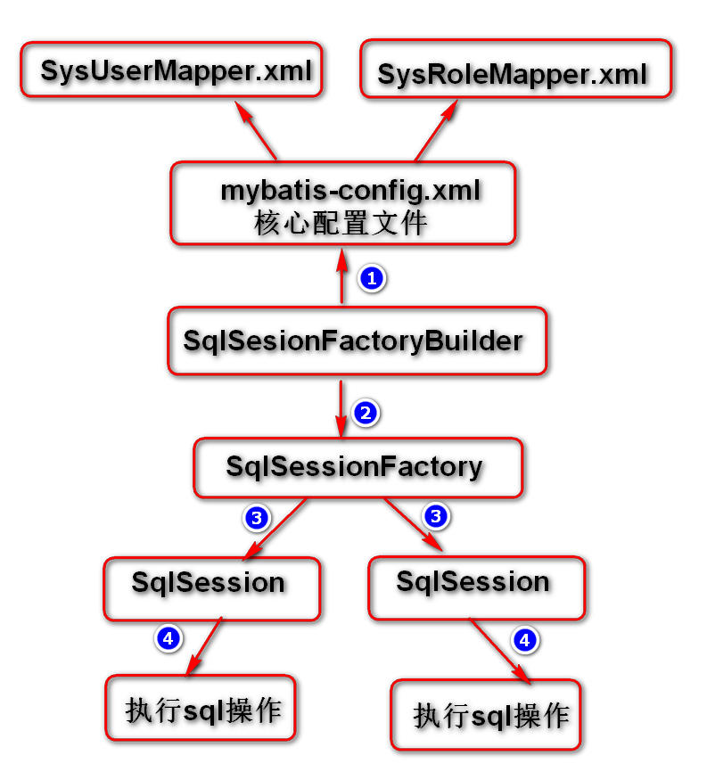

## mybatis 处理流程图

## mybatis 配置

- #### 核心配置文件`mybatis-config.xml`
    > - XML 依赖规则
    >> 
    >>      <!DOCTYPE configuration PUBLIC "-//mybatis.org//DTD Config 3.0//EN" "http://mybatis.org/dtd/mybatis-3-config.dtd">
    > - 开发环境配置 **注意`configuration` 是根标签**
    >> 
    >>      <configuration>
    >>          <environments default="development">
    >>              <environment id="development">
    >>                  <transactionManager type="JDBC" />
    >>                  <dataSource type="POOLED">
    >>                      <property name="driver" value="com.mysql.jdbc.Driver" />
    >>                      <property name="url" value="jdbc:mysql:///test" />
    >>                      <property name="username" value="root" />
    >>                      <property name="password" value="password" />
    >>                  </dataSource>
    >>              </environment>
    >>          </environments>
    >>      </configuration>
    > - `mapper` 配置
    >> - 添加`mapper` 配置 **注意`configuration` 是根标签**
    >>> 
    >>>     <configuration>
    >>>         <mappers><mapper resource="mapper/SysUserMapper.xml" /></mappers>
    >>>     </configuration>
    > - `mapper` 配置中的类**配置别名**
    >> 1. 为某一个类添加别名 **注意`configuration` 是根标签**: 
    >>> 
    >>>     <configuration>
    >>>         <typeAliases>
    >>>             <typeAlias type="com.project.sys.entity.SysUser" alias="sysUser"/>
    >>>         </typeAliases>
    >>>     </configuration>
    >> 2. 为某一个包下所有类添加别名: 默认别名为类首字母小写 **注意`configuration` 是根标签**
    >>> 
    >>>     <configuration>
    >>>         <typeAliases>
    >>>             <package name="com.project.sys.entity"/>
    >>>         </typeAliases>
    >>>     </configuration>

- #### `mapper` 映射配置文件`mapper/SysUserMapper.xml`
- > 依赖规则
    > - 依赖规则
    >> 
    >>     <?xml version="1.0" encoding="UTF-8"?>
    >>     <!DOCTYPE mapper PUBLIC "-//mybatis.org//DTD Mapper 3.0//EN"
    >>         "http://mybatis.org/dtd/mybatis-3-mapper.dtd">
    > - mybatis 中的映射文件，对于这个映射文件必须有一个`mapper` 根元素，这个根元素中必须定义个命名空间 `namespace`，并且这个`namespace` 指到接口一级别，而非包一级别。 
    > - 所有的SQL 语句都必须要有一个id
    >> - SQL 查询
    >> - 对于查询必须要有一个`resultType` 或者 `resultMap`
    >> - `resultType` 的使用
    >>> - 对于查询语句，其中`resultType="map"` 表示查询结果会封装到对应的map类型中，一行记录对应一个map
    >>>> 
    >>>>     <mapper namespace="com.project.sys.dao.SysUserDao">
    >>>>         <select id="findUsers" resultType="map">select * from sys_users</select>
    >>>>     </mapper>
    >>> - 为查询语句指定参数，以及参数类型
    >>>> 
    >>>>     <mapper namespace="com.project.sys.dao.SysUserDao">
    >>>>         <select id="findUserById" parameterType="int" resultType="map">
    >>>>             select * from sys_users where id = #{id}
    >>>>         </select>
    >>>>     </mapper>
    >>> - 将结果指定封装到一个实体类中
    >>> - `resultType="com.project.sys.entity.SysUser"` 可以在mybatis-config.xml 中<a href="#aliase">配置别名</a>
    >>>> 
    >>>>     <mapper namespace="com.project.sys.dao.SysUserDao">
    >>>>         <select id="findObjectById" resultType="com.project.sys.entity.SysUser">
    >>>>             select * from sys_users where id = #{id}
    >>>>         </select>
    >>>>     </mapper>
    >> - `resultMap` 的使用
    >> - 当数据库返回的字段名与要映射对象的属性和set 方法不匹配时，我们就需要使用`resultMap` 来做具体映射
    >>> - 假如我们想要把数据库中查询出来的数据存放到一个vo(Value Object) 对象`Account` 类中。需要实现其`set`、`get` 方法
    >>>> 
    >>>>     public class Account {
    >>>>         private String uname;
    >>>>         private String pwd;
    >>>>         set...   get...
    >>>>     }
    >>> - 那么我们就使用`resultMap` 标签的`result` 子标签的`property`和`column` 做映射
    >>> - 同时`type="account"` <==> `Account`
    >>> - 为其指定一个`id="amap"`
    >>>> 
    >>>>     <mapper namespace="com.project.sys.dao.SysUserDao">
    >>>>         <resultMap type="account" id="amap">
    >>>>             <!-- 将数据库中的username 字段 映射到account 中的uname 属性 -->
    >>>>             <result property="uname" column="username" />
    >>>>             <result property="pwd" column="password" />
    >>>>         </resultMap>
    >>>>     </mapper>
    >>> - 在`select` 标签中指定`resultMap="amap"` `amap` 对应上面的`id="amap"`
    >>>> 
    >>>>     <mapper namespace="com.project.sys.dao.SysUserDao">
    >>>>         <select id="findNameAndPwd" resultMap="amap">
    >>>>             select username, password from sys_users
    >>>>         </select>
    >>>>     </mapper>
    >> - 插入`insert` 语句
    >>> - 所有的 insert、update、delete 都有一个默认的返回类型为int，表示影响的行数
    >>> - 如果我们需要将表中的自增长的ID 值取回保存在对象中，那么我们需要用到`insert` 标签中的`useGeneratedKeys="true" keyProperty="id"` 属性
    >>> - `useGeneratedKeys="true"` 表示要使用自增长的id
    >>> - `keyProperty="id"` 表示要将自增长的id 值赋值给`sysUser` 对象的`id` 属性
    >>> - 前提是数据库需要支持自增长的ID
    >>>> 
    >>>>     <mapper namespace="com.project.sys.dao.SysUserDao">
    >>>>         <insert id="insertObject" parameterType="sysUser"
    >>>>         useGeneratedKeys="true" keyProperty="id">
    >>>>             insert into sys_users(id, username, password, phone, createdDate, modifiedDate) 
    >>>>             values(null, #{username}, #{password}, #{phone}, now(), now())
    >>>>         </insert>
    >>>>     </mapper>
    >>> - 对应的接口方法
    >>>> 
    >>>>     int insertObject(SysUser entity);
    >>> - 在上面的`#{username}` 将会由`entity.getUsername()` 来获取。同时会将使用`entity.setId()` 来将生成的自增长ID 填充进去

    
- > '#' 与 '$' 符号
    > - **配置文件中的'#' 与'$' 符号的区别**
    >> - 以String columnName = "username"; String phone = "139"; 且SQL 如下
    >>> 
    >>>     <select id="findUsers" resultType="sysUser">
	>>> 	    select * from sys_users where phone=#{phone} order by ${columnName} desc
	>>>     </select>

    >>> - 他将被最终解析为:  `select * from sys_users where phone='139' order by username desc`

    >>> - 当使用`${columnName}` 时，那么SQL 语句中将会是 {username} 替换 
    >>> - 当使用`#{phone}` 时，那么SQL 语句中将会是 {'139'} 替换 
    >>> - 也就是说使用# 他会将取出来的值添加一个`''` 认为它是一个字符串(整数不会) 

    > - 提示: 
    > - 1) $符号在应用时有可能会出现SQL 注入的风险。
    >>     使用'#' 防止SQL 注入，比如使用函数: `cancat("%", #{likeStr}, "%"} `
    > - 2) $符号接收接口方法参数值时，此值**必须**要使用`@Param` 注解进行定义
    > - 3) #符号接收接口方法参数数据时，假如接口中参数个数大于一个，建议使用`@Param` 注解对参数进行定义。
    > - 4) #符号在SQL 中将会被替换成`'?'` 占位符

## 用法
- 基本使用
    > 有且仅有一个`SqlSessionFactory` 

        import org.apache.ibatis.io.Resources;
        import org.apache.ibatis.session.SqlSession;
        import org.apache.ibatis.session.SqlSessionFactory;
        import org.apache.ibatis.session.SqlSessionFactoryBuilder;

        public void testUseage() throws IOException {
            InputStream is = Resources.getResourceAsStream("mybatis-config.xml");
            SqlSessionFactory factory = new SqlSessionFactoryBuilder().build(is);
            SqlSession session = factory.openSession();
            List<Map<String, Object>> list = session.selectList(
                    "com.project.sys.dao.SysUserDao.findUsers");

            session.close();
        }

- 通过接口来使用
    - 基础用法: 
        > 首先需要添加一个接口`com.project.sys.dao.SysUserDao`

        >> 我们只需要添加一个接口，不需要去实现它，mybatis 会为我们实现这个接口。

            public interface SysUserDao {
                List<Map<String, Object>> findUsers();
                Map<String, Object> findUserById(Integer id);
                int insertObject(SysUser entity);
            }

        > 接口的包名`com.project.sys.dao.SysUserDao`需要与`mapper/SysUserMapper.xml` 配置文件中根元素里面的的`namespace` 的值保持一致

            <mapper namespace="com.project.sys.dao.SysUserDao"></mapper>

        > 接口中方法名，需要与mapper 文件中sqlid(`select id="findUsers"`) 一致

            <select id="findUsers" resultType="map">
                select * from sys_users
            </select>

        > 使用的时候，参考如下示例代码: 

            InputStream is = Resources.getResourceAsStream("mybatis-config.xml");
            SqlSessionFactory factory = new SqlSessionFactoryBuilder().build(is);
            SqlSession session = factory.openSession();
            SysUserDao sysUser = session.getMapper(SysUserDao.class);
            List<Map<String, Object>> list = sysUser.findUsers();
            session.close();

    - 扩展, 使用注解`@Param("...")`，添加方法参数与SQL 占位符之间的映射关系: 
        > 我们可以为我们的SQL 语句拼接一个列名，或者传入SQL 语句中多个参数时，我们需要为这些参数添加映射关系。通过注解`@Param("...")`

        > 注意'#'与'$' 之间的**区别**
        >> SQL 语句
        >>>     select * from sys_users where phone=#{ph} order by ${columnName} desc
        >> 接口方法
        >>>     import org.apache.ibatis.annotations.Param;
        >>>
        >>>     List<SysUser> findUsers(@Param("columnName") String colName, @Param("ph") String phone);
        >>> 上面的注解`@Param("columnName")` 就表示定义了一个参数，名为: columnName 
        >>> 在SQL 语句中我们就可以使用`${columnName}` 来取到这个对应的参数值了 

## Mybatis 的日志配置及应用

- ### 配置
- > #### spring框架原始配置
    > 1. 添加log4j 依赖
    >>      <dependency>
    >>          <groupId>log4j</groupId>
    >>          <art    ifactId>log4j</artifactId>
    >>          <version>1.2.17</version>
    >>      </dependency>
    > 2. 定义一个`log4j.properties`配置文件放在类路径（例如maven项目的resource目录）
    >>      log4j.rootLogger=INFO,stdout
    >>      # 输出到控制台
    >>      log4j.appender.stdout=org.apache.log4j.ConsoleAppender
    >>      log4j.appender.stdout.layout=org.apache.log4j.PatternLayout
    >>      log4j.appender.stdout.layout.ConversionPattern=%d [%-5p] %c - %m%n
    >>
    >>      log4j.logger.com.mybatis3=DEBUG
    >>      # 指定根包为："com.project"
    >>      log4j.logger.com.project=DEBUG
    > 3. 然后在mybatis核心的配置文件(`mybatis-config.xml`)中添加此日志配置
    >>		<!-- name="logImpl" 为约定值  value="log4j" 对应文件名 -->
    >>		<setting name="logImpl" value="log4j"/>

- > #### springboot 框架配置
    > - 我们只需要在文件里面添加一个配置项的值就可以了。如下: 
    > - `application.properties` 配置文件
    >>      logging.level.com.suyh=debug
    > - 这里前面分两部分
    >> - logging.level 有前缀指定日志配置
    >> - com.suyh 指定mybatis 接口源文件所在的包

## 缓存

- 一级缓存
    > 一级缓存默认就是`SqlSession` 它默认是被打开的。

    > 当我们多次查询相同的SQL 语句时，它只会向数据库做一次请求提交。

    > 一级缓存只存在于`Sqlsession` 中，只要关闭了`SqlSession` 那么缓存就会被清理。

- 二级缓存
    > 二级缓存是基于`SqlSessionFactory` 的，它默认是被关闭的。

    > 如果想要打开二级缓存，则需要在核心配置文件(`mybatis-config.xml`)中添加配置
    >>      <settings>
    >>          <setting name="cacheEnabled" value="true" />
    >>      </settings>
    > 然后再我们的`mapper` 配置文件中添加相应配置。
    >> 1. `eviction="LRU"` 使用LRU 算法, 最近最少访问的优先清理; 
    >> 2. `flushInterval="60000"` 刷新时间(单位: ms); 
    >> 3. `size="512"` 缓存大小(512字节);
    >> 4. `readOnly="true"` 只读;
    >>>     <cache eviction="LRU" flushInterval="60000" size="512" readOnly="true"/>

- 假如希望将来的某个时候,命名空间中共享相同的缓存配置和实例，可以借助cache-ref 元素来引用另外一个缓存。

        <cache-ref namespace="com.someone.application.data.SomeMapper"/>

## 动态SQL

- ### `if` 元素
    - 说明: 
        > 这里我们需要注意的是，在`<if test="phone != nulland phone!=’’">`这里面的`phone`， 它只认识dao 接口中方法通过注解`@Param("phone")` 指定的名称，所以必须要加这个注解。

    - 示例: 
        >       <select id="findUsers" resultType="sysUser">
        >           SELECT * FROM SYS_USERS WHERE id >10
        >           <if test="phone != nulland phone!=’’">
        >               AND phone like #{phone}
        >           </if>
        >           <if test="username != null and username !=''">
        >               AND username like concat("%",#{username},"%")
        >           </if>
        >       </select>

- ### `choose` 组合 `choose ... when ... otherwise`
    - 说明:
        > 动态SQL 中没有`if ... else ...` 这种语法，它可以用`choose ... when ... otherwise ...` 来代替

    - 示例: 
        >       <insert id="insertObject" parameterType="sysRole">
        >           insert into sys_roles(id, name, note, createdTime, modifiedTime, createdUser, modifiedUser) 
        >           values(null, #{name}, #{note}, now(), now(), 
        >           <choose>
        >               <when test="createdUser == null || createdUser == ''">
        >                   'admin',
        >               </when>
        >               <otherwise>
        >                   #{createdUser}, 
        >               </otherwise>
        >           </choose>
        >           <choose>
        >               <when test="modifiedUser == null || modifiedUser == ''">
        >                   'admin'
        >               </when>
        >               <otherwise>
        >                   #{modifiedUser}
        >               </otherwise>
        >           </choose>
        >           )
        >       </insert>
- ### `where` 元素
    - 说明: 
        > where 元素用于定义查询条件,并且可以去除空格或者是and,or等不符合语法要求的字符.

    - 示例: 
        > 添加where 条件，并将第一个判断，去掉前面的and 
        >>      <select id="findUsers" resultType="sysUser">
        >>          SELECT * FROM SYS_USERS
        >>          <where>
        >>              <if test="id != null">
        >>                  and id>#{id}
        >>              </if>
        >>              <if test="phone != null">
        >>                  and phone like #{phone}
        >>              </if>
        >>              <if test="username != null and username !=''">
        >>                  AND username like concat("%",#{username},"%")
        >>              </if>
        >>          </where>
        >>      </select>

- ### `set` 元素
    - 说明: 
        > set 元素用于定义更新字段，并且可以去除多于的','
    
    - 示例: 
        > 注意每一个if 条件里面最后的',' 不能少，如果是最后一个，系统会帮我们把最后的',' 给去除掉的。
		>>      update sys_users 
		>>      <set>
		>>      	   <if test="username != null and username != ''">
		>>      	   	username=#{username},
		>>      	   </if>
		>>      	   <if test="email != null and email != ''">
		>>      	   	email=#{email},
		>>      	   </if>
		>>      	   <if test="modifiedUser != null and modifiedUser != ''">
		>>      	   	modifiedUser=#{modifiedUser}, 
		>>      	   </if>
		>>      	   <if test="mobile != null and mobile != ''">
		>>      	   	mobile=#{mobile},
		>>      	   </if>
		>>      	   modifiedTime=now()
		>>      </set>
		>>      where id=#{id}

- ### `foreach`元素
    - 说明: 
        > - foreach用于迭代mybatis找那个的多个参数数据. 例如根据多个id的值删除多个元素.
    - > `collection` 参数(必选)
        >> - foreach遍历的对象，作为入参时，List对象默认用list代替作为键，数组对象有array代替作为键，Map对象没有默认的键。也就是传入的集合（list，array，map）的名字，这个名字可以在foreach里面随便引用）
        >> - 当然在作为入参时可以使用@Param(“params”)来设置键，设置keyName后，list,array将会失效。 除了入参这种情况外，还有一种作为参数对象的某个字段的时候。举个例子：
        >> - 如果User有属性List ids。入参是User对象，那么这个collection = “ids”
        >> - 如果User有属性Ids ids;其中Ids是个对象，Ids有个属性List id;入参是User对象，那么collection = “ids.id”
        >> - 
        >> - 如果传入参数类型为map，这个入参有注解@Param(“params”)，则map的所有的key集合可以写成params.keys，所有值集合可以写成params.values。这样foreach就可以对key集合或值集合进行迭代了。
        >> - 
        >> - 上面只是举例，具体collection等于什么，就看你想对那个元素做循环。

    - > `item` 参数(可选)
        >> - 循环体中的具体对象。支持属性的点路径访问，如item.age,item.info.details。
        >> - 具体说明：若collection属性为list或array，则item代表list或array里面的一个元素。若collection属性对应一个map，则item代表的是map中的value集合中的单个value

    - > `separator` 参数(可选)
        >> - 元素之间的分隔符，例如在in()的时候，separator=”,”会自动在元素中间用“,“隔开，避免手动输入逗号导致sql错误，如in(1,2,)这样。
    - > `open` 参数(可选)
        >> - foreach代码的开始符号，一般是(和close=”)”合用。常用在in(),values()时
    - > `close` 参数(可选)
        >> - foreach代码的关闭符号，一般是)和open=”(“合用。常用在in(),values()时
    - > `index` 参数(可选)
        >> - 在list和数组中,index是元素的序号，在map中，index是元素的key

    - 示例: 
        > 接口方法:
        >>      int deleteObject(@Param("ids") String[] ids);
        > 映射sql:
        >>      <delete id="deleteObjectById">
        >>          delete from sys_users where id in
        >>          <foreach collection="ids" open="(" close=")" separator="," item="it">
        >>              #{it}
        >>          </foreach>
        >>      </delete>
        > 效果: 
        >>      delete from sys_users where id in (1, 2, 3, 4)

        > 接口方法:
        >>      int insertObject(@Param("userId") Integer userId, @Param("roleIds") Integer[] roleIds);
        > 映射sql:
        >>      <insert id="insertObject">
        >>          insert into sys_roles_users(user_id, role_id) values
        >>          <foreach collection="roleIds" separator="," item="it">
        >>              (#{userId}, #{it})
        >>          </foreach>
        >>      </insert>
        > 效果: 
        >>      insert into sys_roles_users(user_id, role_id) values (1, 1), (1, 2)

- ### sql 元素
    - 这个元素的功能就是SQL 代码的复用。我们可以先声明一段SQL 代码，并为它指定一个ID，然后在需要这段代码的地方利用这个ID 来将其插入到我们的SQL 代码中。

        > 1. 声明一段SQL 代码
        >>      <sql id="whereSqlId">
        >>          <where>
        >>              <if test="name != null and name != ''">
        >>                  name like concat("%", #{name}, "%")
        >>              </if>
        >>          </where>
        >>      </sql>
        > 2. 使用上面声明 的SQL代码.
        >> 使用: `<include refid="whereSqlId" />`
        >> - 比如：查询当前页记录
        >>>     <select id="findPageObjects" resultType="sysRole">
        >>>         select * from sys_roles
        >>>         <include refid="whereSqlId" />
        >>>         order by createdTime desc
        >>>         limit #{startIndex}, #{pageSize}
        >>>     </select>
        >> - 比如： 统计记录数
        >>>     <select id="getRowCount" resultType="int">
        >>>         select count(*) from sys_roles
        >>>         <include refid="whereSqlId" />
        >>>     </select>

- ## 动态SQL 实例

- ### SQL 示例

- > #### 返回一个`List` 对象

    > - dao 层接口
    >>      List<Integer> findObjectByUserId(Integer userId);
    > - sql
    >>      <select id="findObjectByUserId" resultType="integer">
    >>          select role_id from sys_roles_users 
    >>              where user_id=#{userId}
    >>      </select>

- > #### 调用存储过程

    > - 调用存储过程分页
    >>     <select id="pagingPlatformCmAppInfo" 
    >>             parameterType="com.isoftstone.hig.common.model.PagingProceduresInfo"
    >>             resultType="com.isoftstone.hig.platform.api.entity.PlatformCmAppInfo" 
    >>             statementType="CALLABLE">
    >>         { call Proc_CommonPagingStoredProcedure(
    >>                 #{tables,mode=IN,jdbcType=VARCHAR},
    >>                 #{pk,mode=IN,jdbcType=VARCHAR},
    >>                 #{sort, mode=IN, jdbcType=VARCHAR},
    >>                 #{pageNumber, mode=IN, jdbcType=INTEGER},
    >>                 #{pageSize, mode=IN, jdbcType=INTEGER},
    >>                 #{fields, mode=IN, jdbcType=VARCHAR},
    >>                 #{filter, mode=IN, jdbcType=VARCHAR},
    >>                 #{countTotal, mode=IN, jdbcType=BIT},
    >>                 #{total, mode=OUT, jdbcType=INTEGER}
    >>         ) }
    >>     </select>

