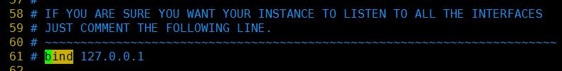
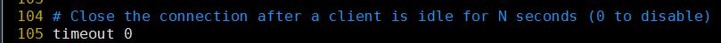
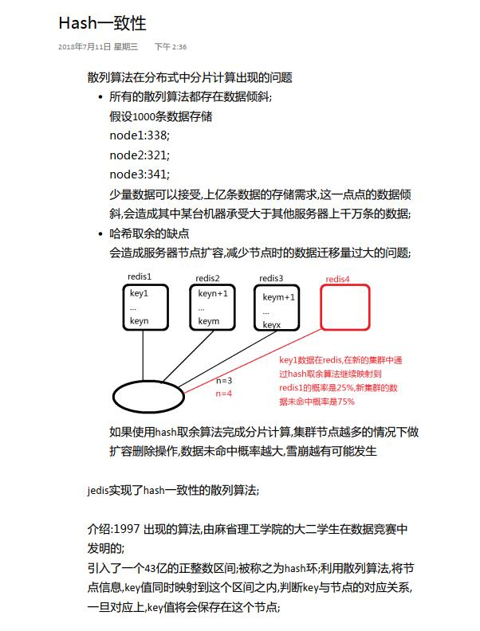

- > ## 雪崩 与 缓存击穿(数据大量未命中)

- 海量数据的访问请求,一旦发起,将会涌入系统,如果缓存数据可命中率高,数据库压力减小,可以提供对外正常的数据处理的能力.当缓存由于各种原因,造成大量数据未命中,海量数据请求涌入数据库;造成数据库宕机--恢复重启--海量请求未消失--宕机--重启;

- 关闭防火墙
    > - `service iptables stop`
    > - 如果是CENTOS 7 的话需要使用下面两个命令，或者安装iptables 命令
    > - `systemctl stop firewalld.service`
    > - `systemctl disable firewalld.service`

- 安装redis 

    > - tar -xf redis-3.2.11.tar.gz
    > - cd redis-3.2.11
    > - make && make install 

- 启动redis
    > - `redis-server redis.conf`
    > - `redis-server` 默认启动

- 使用redis
    > - redis-cli
    >> - redis-cli -h 10.9.17.153 -p 6379
    >>> - 指定连接的IP 以及端口

    > - 退出
    >> - quit  |  exit
    > - 在客户端上停止服务器
    >> - shutdown

- redis 中的数据类型
    > - String:字符串类型;{"id":5,"age":25}
    > - Hash:具有对象结构的value类型 hincrby age +5
    > - List:链表集合;有头有尾有中间;
    > - Set:集合;
    > - Zset:有序集合;

- String 类型命令
    > - `keys * `
    >> - 表示查询当前存储空间中，所有存在的key;
    > - `set \<key\> \<value\>`
    > - `get \<key\> \<value\>`
    > - `select \<整数\>`
    >> - 默认情况下整数的取值区间[0, 15] ，表示当前的redis 服务取用哪个数据分库；功能不常用了。
    > - `exists \<key\>`
    >> - 表示当前内存中是否有你要的key 值存在
    >> - get 也可以判断 key 值的存在。
    >> - redis 默认情况 下value 的数据可以支持到512M。
    >> - 如果使用get 来判断是否有数据的话，它会先读取数据，如果 这个数据太大的话，那么就会造成浪费。
    > - `del \<key\>`
    >> - 将key 值的数据从内存删除
    >> - 主动删除数据时有人工成本；redis 有数据过时剔除的逻辑；
    >>> 1. 超时
    >>> 2. 自带的删除数据逻辑(LRU): lasted recent unused
	> - `$ setex color 10 red`
	>> - 设置 color 的有效期为10 秒
	>> - 也可以使用`expire` 来重新设置它的有效期

- 辅助命令
    > - `type`
    >> - 查看当前数据类型
    > - `help`
    >> - 查看命令的使用，一般我们不用这个命令。要查看命令我们到官网就可以。
    > - `save`
    >> - 将当前服务的所有数据保存到持久化文件(dump.rdb)中
    >> - 这个dump.rdb 文件在安装程序目录中(使用 make && make install 的那个目录下面)
    > - `flushall`
    >> - 将当前服务的所有数据清空(包括持久化文件中的数据)，包括所有分库中的数据全部被清空。
    > - `flushdb`
    >> - 只清空当前分库的数据
    > - `incr \<num\>`  |  `decr \<num\>`
    >> - 自增与自减，步数是1
    > - `incrby \<key\> \<num\>`  |   `decrby \<key\> \<num\>`
    >> - 指定步数的自增与自减
    > - `append \<key\> \<value\>`
    >> - 在存在的key 对应的value 数据中拼接传递的内容
    > - `expire \<key\> 秒`
    >> - 设定当前key 对应的数据超时时间(单位: 秒)
    >> - 超时将会被删除
    > - `ttl \<key\>`
    >> - 查看倒计时，超时之后，ttl 的结果是什么？ 删除数据，key 的超时时间变成 -2
    >> - -1 表示永久数据
    > - `pexpire \<key\> 毫秒`
    >> - 精确超时，单位: 毫秒

- 批量操作
    > - `mset` | `mget`
    >> - 只能在本机节点执行，不支持分布式
    >> - 同时获取多个key 的value 或者同时设置多个数据对

- 高级命令
	> - `keys list*` 模糊匹配，只能用 *
	> - `expire` 设置某个key 的过期时间，使用ttl 查看剩余时间
	>> - `expire name 15` 15 秒时间的过期时间
	>> - `ttl name` 查看name 的剩余时间
	> - `persist` 取消过期时间
	> - `select [数据库下标]` 选择一个指定的数据库
	> - `rename [key-name]` 改名
	> - `dbsize` 查看当前数据库中的key 的数量
	> - `info` 查看redis的信息 全局性
	> - `config get [配置名]` 查看redis 的一些配置项
	>> - `config get *`
	> - `flushdb` 清空当前数据库
	>> - `flushdb 0` 清空指定数据库
	> - `flushall` 清空全部数据库
	
	
- Hash 数据类型(类比JAVA 中的HashMap)
	> - hset hget 都是对key 进行求Hash 然后对槽道取余，选择槽道位置。
	>> - 如果一个hset user 中存储的数据量过大，那么这些所有数据都会存放在一个槽道对应的主机节点中。
    > - 面向对象数据类型
    > - `hset user id 1`  |  `hget user id`
    >> - hash 数据类型的设定和读取
    > - `hexists user id`
    >> - 判断属性是否存在 返回true false
    > - `hdel`
    >> - 删除属性
    > - `hkeys` | `hvals`
    >> - 只获取hash 数据的key 值对应的hashkey 或者 hashvalue
    > - `hincrby`   ||  没有自减命令
    >> - 对某个key 的value 进行自增
    > - `hlen`
    >> - 判断当前hash 类型数据的属性个数
	> - `hgetall [key]`

- List 数据集合链
    > - ## 操作命令分左右，数据查看是上下
    > - `lpush` 
    >> - 往链表头部添加一个元素
    > - `lrange`   没有`rrange` 命令
    >> - 查看一个链表中的元素，需要指定下标范围
    >>> - `lrange list1 0 3` 查看从0 到3 4 个数据
    >>> - `lrange list1 0 -1` 查看所有数据
    > - `rpush`
    >> - 往链表尾部添加一个元素
    > - `lset`
    >> - 设置list中对应下标的元素值;
    > - `lrem`  没有`rrem` 命令
    >> - 从key 对应的list 中删除count 个相同value 数据的元素，count 可以大于0， 小于0， 等于0 
    >> - 大于0 表示从正方向删除count 个元素
    >> - 小于0 表示从反方向删除count 个元素
    >> - 等于0 删除所有相同的元素
    >>> - `lrem mylist 0 two`  删除 mylist 链表中所有的 two 元素
    > - `lpop`
    >> - 从头部删除一个元素，并返回
    > - `rpop` 
    >> - 从尾部删除一个元素，并返回
    > - `rpoplpush`
    >> - 从第一个list 的尾部移除元素，添加到第二个list 的头部
    >>> - `rpoplpush mylist mylist1`
	> - `lindex` 返回指定下标位置的元素
	> - `llen`  链表的个数

- set  String 类型的无序集合
	> - 这里所说的无序，指的是插入到set 中，set 是不会给我们排序，插入是什么顺序，查看就是什么顺序。
	> - 取交集、并集、差集
	> - `sadd` 添加元素
	> - `srem` 删除元素
	> - `spop` 随机返回删除的key
	> - `smembers` 查看集合中的所有元素
	> - `sdiff` 返回两个集合的不同元素(以前面一个集合为标准)
	> - `sdiffstore` 将返回的不同元素存储到另外一个集合中
	> - `sinter` 交集
	> - `sinterstore` 将返回交集结果存入另外一个集合中
	> - `sunion` 取并集
	> - `sunionstore` 取得并集，存入另外一个集合中
	> - `smove` 从一个集合中移动到另一个集合
	> - `scard` 查看集合中元素个数

- zset 有序集合
	> - 按给定的评分来进行排序
	> - `zadd` 添加一个元素，如果这个元素存在，则会修改其评分的值。
	>> - `zadd zset1(集合名称) 6(评分) six(元素)`
	> - `zrange zset1 0 -1 withscores` 查看元素，同时显示评分
	> - `zrange zset1 0 -1` 不显示评分

- > ##  redis-server 配置文件

    > - 通过配置文件启动
    >> - `redis-server [redis 配置文件]`
    >> - `redis根目录/redis.conf` 是根目录的模板配置文件
    > - 修改配置文件
    >> - p61 行 --> 注释
    >> - 指定哪些IP 地址可以连接到此服务器
    >>> 
    >> - p80 行  --> 修改为no 不启用保护模式
    >> - 如果开启了保护模式，则需要登录密码
    >>> 
    >> - p84 行  -->  6379是默认端口(要启动其他的redis实例需要修改端口)
    >>> 
    >> - p105 行 -->  当客户端空闲时间达到一小时,就会自动断开连接,0秒表示不启用超时配置
    >>> 
    >> - 128 行 --> 启动时是否守护进行
    >>> redis-conf-daemonize-05.jpg
    >> - p150  -->  对应不同的redis实例,pid的文件名称.需要和端口同名
    >> - P164  -->  指定到redis跟目录生成当前进程的log文件
    >> 
    >> - p178   -->   指定默认开起的数据库个数
    >>> 
    >> - save 900(秒) 1(变动的数据条数)
    >> - 当900以内,至少有1条数据变动,看是flush保存数据到文件
    >> - save 300 10
    >> - 300秒以内至少10条数据变动,保存文件
    >> - save 60 10000
    >> 
    >> - P238 指定当前进程对应的持久化rdb文件,redis根目录
    >>> 

- > HASH 一致性
    >> `G:\terena\java\java-1803-课程\day03\day03all.pdf`
    >> 

    >> 
<mark>图示</mark>

    >> 
    >>> 
    >> 

    >> 

- > HASH 一致性
    > - 在Redis 集群中，增加或者减少Redis 节点时，要尽量减少未命中的情况而引入的一种技术；
    > - [0, 2^32) 这样一组数字遇到到一个圆环上面；
    > - 所有的Master 节点按一定规则进行Hash 取值，并映射到这个圆环上面；
    > - 所有的Key 进行Hash 取值也映射到这个圆环上面，并按顺时针搜索最近的一个Master 节点；
    > - 那么这个Key 就被保存到这个节点上面，不管是读还是写都是一样的；
    > - 每一个Master 节点都有多个虚拟节点，被搜索到这些虚拟节点的Key 则被共同存储到同一个物理节点上；

