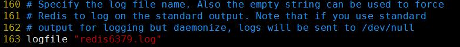

- ## Redis server 的相关配置
    > 1. 在解压并安装redis 的那个根目录 下面有一个配置文件模板(`redis.conf`)
    > - 修改配置文件
    >> - p61 行 --> 注释掉bind 所在的那一行，redis 服务器监听的IP 有哪些，或者改成 "0.0.0.0"
    >>> 
    >> - p80 行  --> 修改为no 不启用保护模式, 如果开启了保护模式，则需要登录密码
    >>> 
    >> - p84 行  -->  6379是默认端口(要启动其他的redis实例需要修改端口)
    >>> 
    >> - p105 行 -->  当客户端空闲时间达到一定时间,就会自动断开连接,0秒表示不启用超时配置
    >>> 
    >> - 128 行 --> 是否以守护进程进行启动
    >>> 
    >> - p150  -->  对应不同的redis实例,pid的文件名称.需要和端口同名
    >>> 
    >> - P163  -->  指定到redis根目录生成当前进程的log文件
    >>> 
    >> - p178   -->   指定默认开起的数据库个数
    >>> 
    >> - p202 --> 指定保存数据方案
    >>> - save 900(秒) 1(变动的数据条数)
    >>> - 当900以内,至少有1条数据变动,看是flush保存数据到文件
    >>> - save 300 10
    >>> - 300秒以内至少10条数据变动,保存文件
    >>> - save 60 10000
    >>>
    >>> 
    >> 
    >> - P238 指定当前进程对应的持久化rdb文件,redis根目录
    >>> 

- ## 通过配置文件启动
    > - 通过配置文件启动
    >> - `redis-server [redis 配置文件]`
    >> - `redis根目录/redis.conf` 是根目录的模板配置文件

- ## 指定端口登录redis
    > - `redis-cli -p 6380`

