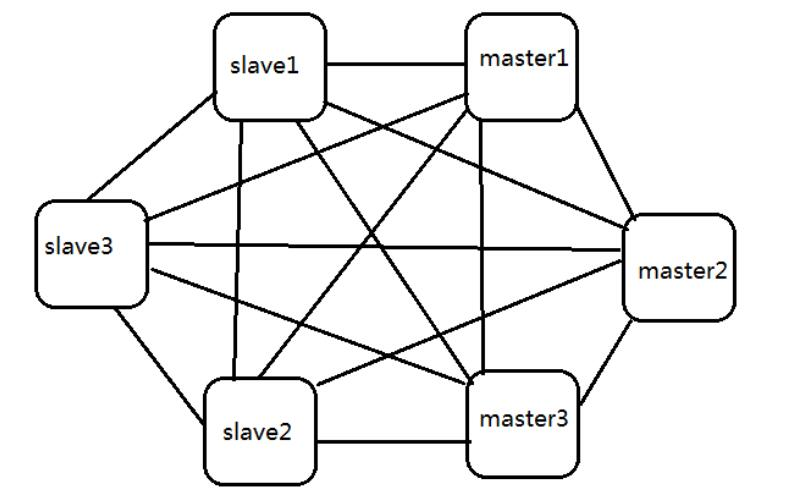
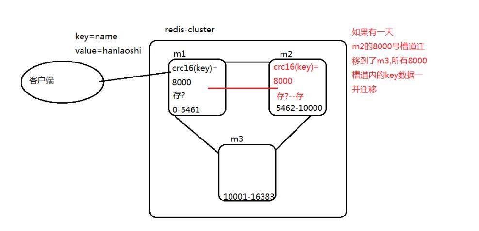
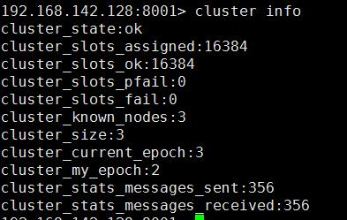

- ## Redis cluster 集群
    > - 它是Redis 3.0 之后出现的一种新的技术；

- ### Redis cluster 集群的特点
    - > 图示
        >> 

        >> 
<mark>redis-cluster 集群示例图</mark>

        >> 
        >> 
        >> 

    - > 集群特点
        > - 集群里面的所有Redis 节点(包括从节点)之间两两相连；
        > - 它们内部使用二进制协议来优化传输速度；
        > - 哨兵进程取消了，机制整合到了主节点的功能当中；
        > - 节点事件，例如 fail, 是通过过半选举得出的结论。所有集群的主节点参与选举(这个就是之前的哨兵功能)；
        > - 如果当前集群的有效主节点一但少于一半，集群将不可用；
        > - 客户端(jedit) 与redis-cluster 的联通不再是收集全部信息才能通信；只需要至少连接一个节点，就可以实现数据的分布式存储；
        > - redis-cluster 把所有的主节点映射到[0-16383]区间对应的“槽道”号上，各自主节点就维护了一个槽道号的分片区间；
        > - 当key 值在传入任何一个节点时，进行哈希取模运算，得到一个对应的槽道号，然后才能由负责这个槽道号对应的节点存储数据；

- ### Redis cluster 槽道图解
    - > 图解
        >> 

        >> 
<mark>Redis cluster 槽道图解</mark>

        >> 
        >> 
        >> 

    - > 槽道需要解决两个问题
        >> 1. 获取数据的节点如何判断当前key 值的取模结果，它是否在自己的管理范围内；
        >> 2. 若不归自己管理时，如何获取正确的管理槽道 的节点。

- ### Redis cluster 集群的安装
    > - 因为集群命令文件需要ruby 语言的支持，所以我们首先需要安装ruby(ruby-2.3.1)
    > - 使用yum 安装gems
    >> - 它是一个Ruby 组件进行打包的Ruby 打包系统; 
    >> - 它提供一个分发Ruby 程序和库的标准格式，还提供一个管理程序包安装的工具。
    >> - 简单理解就是ruby 运行时，需要的各种插件都在gems 里;
    > - 使用命令`gem install redis` 安装redis 接口包
    > - 最后，Redis 必须安装 

- ### Redis cluster 集群的配置、使用与测试
    - > #### 创建节点(为每一个节点进行配置)
        > - 我们首先创建6 个Redis 节点，分别为其分配一个目录，以端口为其命令目录名；
        >> - `mkdir 8000 8001 8002 8003 8004 8005`
        > - 配置文件(redis.conf 模板文件), 先配置好一个模板文件，然后为每一个不同的节点修改端口
        >> 

        >> 
<mark>Redis cluster 详细配置说明</mark>

        >> 
        >> - p61 行，注释掉`bind ` 相关的配置，表示它允许任何IP 来进行访问
        >> - P80 行, `protected-mode no`    表示不使用保护模式，即外网(非本机)也可以访问
        >> - p84 行，`port 8000` 指定访问端口
        >> - p128 行，`daemonize yes` 指定以守护进程运行
        >> - p150 行，`pidfile /var/run/redis_8000.pid`  pidfile 文件对应8000
        >>> - 当大量的进程启动后，很难通过 ps - ef | grep redis-server 直接寻找到你需要操作的进程的PID
        >> - p163 行，`logfile "8000/redis.log"`  指定一个日志文件
        >> - p224 行，`rdbcompression yes` 指定一个当前服务加载的持久化文件
        >> - p593 行，`appendonly yes` 开启AOF 持久化模式
        >>> - rdb 持久化和aof 持久化模式对比: 
        >>>> - rdb: 需要客户端必须调用命令 save 完成数据从内存保存到磁盘的操作；没有来得及save 的数据一但丢失，数据出现未命中；
        >>>> - aof: 二进制的日志，实时记录redis 客户端操作时所有写命令；没有来得及save 的数据不保存在dump 里，但是命令内容，保存在了aof 文件，恢复时，只需要将没save 的所有内容的命令调出来。
        >>>>> - 小数量的性能对比：开启aof 模式，比rdb 单独使用，多消耗2 时间
        >> - p721 `cluster-enabled yes`   
        >>> - 加载当前配置文件的redis 服务一但启动需要开启集群模式，否则无法使用集群的各种策略和逻辑
        >> - p729 `cluster-config-file nodes-8000.conf`  
        >>> - 集群配置启动后，将会创建这个nodes 文件，记录当前服务器上唯一 的一个集群状态；
        >>>> - 例如搭建了8000-8005 这样一个集群，操作失误下，集群失效，重新搭建集群，当前服务器读取这个配置文件会发现，槽道已经被一个集群分配了，新的集群搭建失败；
        >>>> - 这个时候我们将这些文件删除掉就可以新建成功了。重启的时候也需要将这些文件给删除。
        >>>> - 还有`dump` 数据文件删除，防止启动起来之后，数据非空而失败。
        >> - p735 `cluster-node-timeout 15000`  请求超时 默认15 秒
        >> 

    - > 按上面的配置说明分明配置出多个，然后各自修改其端口号就可以启动了。
        > - 通过命令指定配置文件`redis-server 8000/redis.conf` 将6 个节点全部启动起来
        > - `cluster` 集群的连接命令需要添加一个 `-c` 参数: `redis-cli -c -p 8000`
        >> - -c 以集群状态登录节点(本质上是对单个节点的命令封装);
        >> - 但是这个时候所有的节点并不是集群状态,我们单独登录节点一样无法实现集群的操作

    - > #### 创建集群
        > - 在redis 根目录的src 目录下面有一个ruby 命令`redis-trib.rb`
        >> - 它是一个ruby 语言编写的快速操作集群的命令，整合了底层客户端的各种各样的命令
        > - 执行创建集群命令(<mark>**redis 集群最少需要3 个master 才能正常运行**</mark>) 
        >> - `redis-trib.rb create 192.168.142.128:8000 192.168.142.128:8001 192.168.142.128:8002`
        >>> - 这个命令执行前，这些节点需要是正在运行状态。
        >>> - 它有一个`--replicas 1` 参数，用来为每一个master 自动添加至少一个从节点。这里我们没有使用。
        >>> - 然后会有一个是否接受槽道的分配方式, yes 就好
		>>> - 如果主从数量不匹配，多出来的会自动分配为某个主节点的从节点(没有去试过)
        >>>> 
        >> - 这个时候集群就搭建成功了，但是我们还没有为他们指定从节点。所以无法做到高可用。
        >> - 我们可以使用`redis-cli -c -p 8000` 登录到上面使用命令查看它们的一些状态信息
        >>> - 查看集群状态: `cluster info`
        >>>> 
        >>> - 查看集群节点: `cluster nodes`
        >>>> 
		>>> - 集群节点信息
		>>>> - `9eb0738ab0dc7880bb52fc63297dedaaa64b0fae(节点ID) 192.168.159.135:7002(节点IP:端口) myself(当前连接上的就是这个节点),master(主节点) - 0 0 2(序号) connected(正常连接到集群) 5461-10922(槽道号范围)`
		>>>> - `ff1594d30aaea2e202d152dc4b56de6c2190210e 192.168.159.135:7004 master,fail(该节点异常，已经挂了) - 1580978610294 1580978609786 4 disconnected(断开连接) 0-49`
		>>>> - `ff64a5e8d8bea6c8691bb66798aa2ad2f30e6d0e 192.168.159.135:7005 slave aefa27e1ddda67e6b9416b0f76c423a38ba62dd2(对于slave 节点，挂接的master节点ID) 0 1580979537237 1 connected`
    - > #### 动态添加节点到这个集群中
        > - `[root@localhost src]# ./redis-trib.rb add-node 192.168.142.128:8005 192.168.142.128:8000`
        >> - `./redis-trib.rb add-node <需要添加的一个节点> <添加到哪一个集群，指定这个集群中的任意一个节点IP:PORT>`
        >> - 如果添加的这个节点中存在数据，那么添加会失败。你只需要将其中的数据给删除就可以了。
        >> - 因为集群的所有数据都需要为其指定一个槽道。
        >> - 默认情况下新添加的节点都是master 角色，并且没有分配置管理槽道。
        > - 我们可以为新添加的master 节点迁移部分槽道过来
        >> - `./redis-trib.rb reshard 192.168.142.128:8000(集群中的任意一个节点)`  重新分配槽道命令，后面跟的节点可以是任意节点
        >>> - 首先你需要告诉redis 你要重新分配的槽道数量
		>>>> - `How many slots do you want to move (from 1 to 16384)? `
		>>>> - 我产可以在后面输入要重新分配置的槽道数量，比如：50
        >>> - 其次就是这些槽道要迁移到哪一个主节点ID上面
		>>>> - `What is the receiving node ID? `
		>>>> - 也就是新添加的那个节点，即：上面的那50 个槽道将会分配给它。
		>>>> - 我们可以用 `cluster nodes` 来查看节点ID
        >>> - 再次这些槽道要从哪里迁移过来
		>>>>
		>>>>		Please enter all the source node IDs.
		>>>>		    Type 'all' to use all the nodes as source nodes for the hash slots.
		>>>>		    Type 'done' once you entered all the source nodes IDs.
		>>>>		Source node #1:aefa27e1ddda67e6b9416b0f76c423a38ba62dd2
		>>>>		Source node #2:9eb0738ab0dc7880bb52fc63297dedaaa64b0fae
		>>>>		Source node #3:done
		>>>>
        >>>> - 如果是从其他主节点平均迁移，那么指定`all`就可以了，否则需要指定其主节点ID
        >>>> - 指定完主节点ID 之后需要输入 done 才会完成。
		>>>> - 如上面所示，就是从两个原来的节点平均获取，然后分给指定的那个节点。
		>>> - 最后确认
		>>>> - `Do you want to proceed with the proposed reshard plan (yes/no)?`
		>>>> - 输入 `yes` 就好
        >>> - 最后只有无数据的空槽道才可以用这个命令迁移，非空槽道需要用后面的技术才能做迁移。
        >>> - 使用`8000> cluster nodes` 命令可以查看迁移后的各节点信息。
		>>> 
        >>> 

        >>> 
<mark>槽道重新配置</mark>

        >>> 
        >>>        [root@localhost src]# ./redis-trib.rb reshard 192.168.142.128:8003
        >>>        >>> Performing Cluster Check (using node 192.168.142.128:8003)
        >>>        M: 76486af7a30a8feca936f3f6f85cd43e2335cf44 192.168.142.128:8003
        >>>           slots: (0 slots) master
        >>>           0 additional replica(s)
        >>>        M: 3508dff27b1e6486d0930cfa0dbf24a822abe630 192.168.142.128:8001
        >>>           slots:5461-10922 (5462 slots) master
        >>>           0 additional replica(s)
        >>>        M: ce9e828061959e047e62348a341aced055243c0e 192.168.142.128:8000
        >>>           slots:0-5460 (5461 slots) master
        >>>           1 additional replica(s)
        >>>        S: 922aed62b53d2e3188a070721a6405fa349e4b56 192.168.142.128:8004
        >>>           slots: (0 slots) slave
        >>>           replicates ce9e828061959e047e62348a341aced055243c0e
        >>>        M: c1395499ee0b9602285d2284f1fd413b3c801b6b 192.168.142.128:8002
        >>>           slots:10923-16383 (5461 slots) master
        >>>           0 additional replica(s)
        >>>        [OK] All nodes agree about slots configuration.
        >>>        >>> Check for open slots...
        >>>        >>> Check slots coverage...
        >>>        [OK] All 16384 slots covered.
        >>>        How many slots do you want to move (from 1 to 16384)? 50
        >>>        What is the receiving node ID? 76486af7a30a8feca936f3f6f85cd43e2335cf44
        >>>        Please enter all the source node IDs.
        >>>          Type 'all' to use all the nodes as source nodes for the hash slots.
        >>>          Type 'done' once you entered all the source nodes IDs.
        >>>        Source node #1:ce9e828061959e047e62348a341aced055243c0e
        >>>        Source node #2:done
        >>> 

		> - ## 最后要注意的是，这些被移动的槽道不能有数据。若有数据是不可以被移动的。
    - > #### 添加一个新节点到集群中，并指定其为从节点
        > - `./redis-trib.rb add-node --slave --master-id ce9e828061959e047e62348a341aced055243c0e 192.168.142.128:8004(新添加的节点) 192.168.142.128:8000(目标集群任意节点)`
        >> - 添加一个新的节点(192.168.142.128:8004)到集群(192.168.142.128:8000) 中，且为从节点，指定它的主节点为(ce9e828061959e047e62348a341aced055243c0e)
        >> - 使用命令`cluster nodes` 可以查看到它的角色为`salve`
        > - KILL 掉主节点然后等一段时间之后就可以验证集群的主从备份是否生效，这个时间会有点长。它们要进行选举得出最后的结论。
    - > #### 删除一个节点
        > - 有槽道的主节点不能直接删除，需要先将其槽道迁移。
        > - `./redis-trib.rb del-node 192.168.142.128:8000(指定集群) 922aed62b53d2e3188a070721a6405fa349e4b56`
        >> - `./redis-trib.rb del-node <任意节点(集群)> <要删除的节点ID>`
        >>> 

        >>> 
<mark>删除成功提示</mark>

        >>> 
        >>>>           >>> Removing node 922aed62b53d2e3188a070721a6405fa349e4b56 from cluster 192.168.142.128:8000
        >>>>           >>> Sending CLUSTER FORGET messages to the cluster...
        >>>>           >>> SHUTDOWN the node.
        >>> 

- ### 集群的重启(这个只能在测试环境下使用，生产环境我们不应该做重启操作，这样会丢失数据)
    1. > 杀掉所有节点服务
    2. > 删除文件
        >> - 删除所有`nodes-8000.conf` 记录当前服务器的唯一一个集群的节点状态
        >> - 删除所有`dump8000.rdb` 
        >> - 删除共享文件`appendonly.aof`
    3. > 正常启动集群

- ### 手动搭建集群
    1. > 启动全部节点
    2. > 手动握手
        >> - 登录任何一个节点
        >>> - `redis-cli -c -h 192.168.142.128 -p 8000`
        >> - `8000> cluster meet ip port`   (ip 端口是其他节点信息)
        >>> - 需要将其他所有节点都meet 上来
        >>> - 这个时候这些节点都添加到集群中来了，但是它们都是没有管理槽道的，所以这个时候的集群状态是fail
        >> - `cluster addslots 槽道号` 命令可以添加槽道
        >>> - 我们可以借助SHELL 脚本来添加槽道号
    3. > 将一些主节点变更为从节点
        >> - 登录到目标节点(要变更为从的那个节点)
        >>> - 命令`cluster replicate dec454918ff966249a35ee4b2460c61cc09da709`
        >>> - 它指定将本节点变更为哪一个节点的从节点，后面跟的是目标主节点ID

- ### 槽道迁移
	- > 槽道状态
		>> - 正常: stable
		>> - 导入: importing
		>> - 导出: migrating
		>> - 槽道的状态是正常、导入、导出时，都不影响数据 的插入。但是数据微调的时候，集群不能对外提供服务。
- #### 空槽道的迁移(可以使用 ruby 脚本的 reshard 操作)
	- > 以5798(空槽道，name 的hash 求值对应的槽道) 从7002 节点迁到 7001 节点为例
		> - 1. 进入7002 节点，将槽道迁出。
		>> - `$ redis-cli -c -p 7002`
		>> - `7002> cluster setslot 5798(槽道号) migrating 4204db55cbe4074b924c3da38f00f4e51a9e0541(7001 的节点ID)`
		>> - `7002> cluster nodes` 在7002 节点上可以查看到5798 已经是迁出状态
		>>> - c0666bcbf0d3e62f131a4269b6056c634cbc9687 192.168.159.136:7002 myself,master - 0 0 2 connected 5461-10922 [5798->-4204db55cbe4074b924c3da38f00f4e51a9e0541](迁出状态)
		> - 2. 进入7001 节点，将槽道迁入。
		>> - `$ redis-cli -c -p 7001`
		>> - `7001> cluster setslot 5798(槽道号) importing c0666bcbf0d3e62f131a4269b6056c634cbc9687(7002 的节点ID)`
		>> - `7001> cluster nodes` 在7001 节点上可以查看到5798 已经是迁入状态
		>>> - 4204db55cbe4074b924c3da38f00f4e51a9e0541 192.168.159.136:7001 myself,master - 0 0 1 connected 0-5460 [5798-<-c0666bcbf0d3e62f131a4269b6056c634cbc9687]
		> - 3. 进入每一个master 节点，执行有槽道变更的通知。
		>> - 这里只需要在master 节点上操作，slave 节点上不需要也不能操作。
		>> - `$ redis-cli -c -p 7001`
		>> - `7001> cluster setslot 5798 node 4204db55cbe4074b924c3da38f00f4e51a9e0541(7001 节点ID，5798 槽道现在属于这个节点了)`
		>> - `$ redis-cli -c -p 7002`
		>> - `7002> cluster setslot 5798 node 4204db55cbe4074b924c3da38f00f4e51a9e0541(7001 节点ID，5798 槽道现在属于这个节点了)`
		>> - `$ redis-cli -c -p 7003`
		>> - `7003> cluster setslot 5798 node 4204db55cbe4074b924c3da38f00f4e51a9e0541(7001 节点ID，5798 槽道现在属于这个节点了)`
		> - 这个时候再往集群里面添加 set name suyh 时，就会切换到7001 而非7002 了

- #### 非空槽道的迁移
	- > 非空槽道的迁移，只是比空槽道的迁移多了一步数据的迁移，其他都是完全一样的
	- > 以15355(gender 为key 对应的槽道号) 从7003 节点迁移到7002 节点为例
		> - 1. 进入7003 节点，将槽道迁出。
		>> - `$ redis-cli -c -p 7003 cluster setslot 15355 migrating c0666bcbf0d3e62f131a4269b6056c634cbc9687`
		>>> - 我们可以直接在命令行执行上面的命令
		>> - `$ redis-cli -c -p 7003 cluster nodes`
		>>> - 直接在命令行，查看节点信息
		> - 2. 进入7002 节点，将槽道迁入。
		>> - `$ redis-cli -c -p 7002 cluster setslot 15355 importing c01c794ecf7d788b23602ce98c45d4a3a78734cb`
		> - 3. 数据的迁移
		>> - a. 进入7003 节点(数据所在节点)。
		>>> - `$ redis-cli -c -p 7003`
		>> - b. 查看当前槽道上有哪些key
		>>> - `7003> cluster getkeysinslot 15355(槽道号) 500(最多列出500 个)`
		>> - c. 执行迁移，一旦迁移成功，源数据库中的key 将会被删除。
		>>> - `7003> migrate 192.168.159.136 7002 ""(3.0.6 之后这个就总是空字符串) 0(redis db 号：0-15) 500(超时毫秒) keys gender`
		>>> - migrate 有参数，可以执行批量操作。
		>>> - `migrate 192.168.159.136 7002 "" 0 500 copy`
		>>>> - 拷贝到目标节点上
		>>> - `migrate 192.168.159.136 7002 "" 0 500 replace`
		>>>> - 如果目标节点上有数据，则直接替换
		> - 4. 进入每一个master 节点，执行有槽道变更的通知。
		>> - 这里只需要在master 节点上操作，slave 节点上不需要也不能操作。
		>> - `$ redis-cli -c -p 7001`
		>> - `7001> cluster setslot 15355 node c0666bcbf0d3e62f131a4269b6056c634cbc9687(7002 节点ID，15355 槽道现在属于这个节点了)`
		>> - `$ redis-cli -c -p 7002`
		>> - `7002> cluster setslot 15355 node c0666bcbf0d3e62f131a4269b6056c634cbc9687(7002 节点ID，15355 槽道现在属于这个节点了)`
		>> - `$ redis-cli -c -p 7003`
		>> - `7003> cluster setslot 15355 node c0666bcbf0d3e62f131a4269b6056c634cbc9687(7002 节点ID，15355 槽道现在属于这个节点了)`

- ### 槽道
    - > 16384 bit = 2048 * 8 Byte = 2KB
    - > 什么是槽道？
        > - 说白了槽道其实就是一组整数数字，它的范围区间为: [0, 16384)
        > - Redis 对每一个Key 进行Hash 取模之后对应一个槽道
    - > Redis 集群槽道的管理
        > - ### *节点共享数组*
        >> - `Object[16384]`
        >> - 一个16384 个元素的数组 
        >> - 下标对应遭道号
        >> - 每一个元素保存着这个槽道的所属节点的信息
        >> - 通过这个数组可以找到管理该槽道的节点
        > - ### *节点私有数组*
        >> - `Byte[2048]`
        >> - 一个16384 个二进制数的序列(即: 2KB的字节数组)  
        >> - 每一个下标所对应的二进制位表示此位置是否有数组
        > - ### *节点私有map*
        >> - map{槽道号, [key的集合]}
        >> - 每一个节点都有这样一个map ，映射每一个槽道当前管理着哪些key

- ## 集群配置
	- > `bind 0.0.0.0`
		> - 监听的IP
	- > `port 7001`
		> - 监听端口
	- > `protected-mode no`
		> - 必须关闭保护模式，不然集群创建不了
	- > `daemonize yes`
		> - 守护进程
	- > `logfile "/usr/local/redis-cluster/logs/redis-7001.log"`
		> - 日志文件位置
	- > `dbfilename dump.rdb`
		> - 数据文件的文件名
	- > `dir /usr/local/redis-cluster/7001/`
		> - 指定数据文件(dump.rdb)的存放位置
	- > `appendonly yes`
		> - 是否以AOF 模式记录日志文件
	- > `appendfilename "appendonly.aof"`
		> - AOF 日志文件名
	- > `appendfsync always`
		> - AOF 模式的写日志频率
	- > `cluster-enabled yes`
		> - 打开集群功能，默认是注释的。
	- > `cluster-config-file nodes-7001.conf`
		> - 每一个节点(包括主从节点)都需要知道其他节点的存在，依靠的是这个配置
		> - 默认是注释的
- ## 集群启动
	- > 正常启动每一个节点
		> - `$ redis-server 7001/redis.conf`
		> - `$ netstat -tunpl | grep redis`
		>> - 查看是否都成功启动了
	- > 创建集群
		> - `$ redis-trib.rb create 192.168.159.135:7001 192.168.159.135:7002 192.168.159.135:7003`
		> - `$ redis-trib.rb create --replicas 1 192.168.159.135:7001 192.168.159.135:7002 192.168.159.135:7003 192.168.159.135:7004 192.168.159.135:7005 192.168.159.135:7006`
		>> - 使用 replicas 指定从节点数量
	- > 登录集群
		> - `$ redis-cli -c -h 192.168.159.135 -p 7001`
		>> - 可以登录到任何一个集群就可以操作整个集群了
	- > 再次启动
		>> - 再次启动，这几个节点就是集群模式了。不用再次创建了，只需要将几个节点依次启动就可以了。
	- > 取消集群
		>> - redis 没有取消集群的操作，如果要取消集群的话，我们需要将所有的 nodes-700*.conf 文件删除就可以了。
	- > 批量启动shell 脚本
		>>		for port in 7001 7002 7003 7004 7005 7006
		>>		do
		>>			REDIS_CMD="redis-server $port/redis.conf"
		>>			# 好像不加 `` 也可以
		>>			`$REDIS_CMD`
		>>			echo $REDIS_CMD
		>>		done
	- > 批量停止
		>>		for port in 7001 7002 7003 7004 7005 7006
		>>		do
		>>			REDIS_CMD="redis-cli -p $port shutdown"
		>>			$REDIS_CMD
		>>			echo $REDIS_CMD
		>>		done

集群命令 使用 redis-cli 登录之后再用
cluster info ：打印集群的信息
cluster nodes ：列出集群当前已知的所有节点（ node），以及这些节点的相关信息。
节点
cluster meet <ip> <port> ：将 ip 和 port 所指定的节点添加到集群当中，让它成为集群的一份子。
cluster forget <node_id> ：从集群中移除 node_id 指定的节点(保证空槽道)。
cluster replicate <node_id> ：将当前节点设置为 node_id 指定的节点的从节点。
cluster saveconfig ：将节点的配置文件保存到硬盘里面。
槽(slot)
cluster addslots <slot> [slot ...] ：将一个或多个槽（ slot）指派（ assign）给当前节点。
	>> - `cluster addslots 0` 分配0 号槽道给当前登录的节点
	>> - 我们可以使用shell 脚本来批量添加槽道
	>> - `for i in {1..5461}; do redis-cli -h 192.168.159.135 -c -p 7001 cluster addslots $i; done`
cluster delslots <slot> [slot ...] ：移除一个或多个槽对当前节点的指派。
cluster flushslots ：移除指派给当前节点的所有槽，让当前节点变成一个没有指派任何槽的节点。
cluster setslot <slot> node <node_id> ：在master 节点上操作，通知该节点有槽道变更。 将槽 slot 指派给 node_id 指定的节点，如果槽已经指派给
另一个节点，那么先让另一个节点删除该槽>，然后再进行指派。
cluster setslot <slot> migrating <node_id> ：迁出槽道 - 将本节点的槽 slot 迁移到 node_id 指定的节点中。
cluster setslot <slot> importing <node_id> ：迁入槽道 - 从 node_id 指定的节点中导入槽 slot 到本节点。
	cluster setslot 10923(槽道号) importing 源节点ID
cluster setslot <slot> stable ：取消对槽 slot 的导入（ import）或者迁移（ migrate）。
键
cluster keyslot <key> ：计算键 key 应该被放置在哪个槽上。
cluster countkeysinslot <slot> ：返回槽 slot 目前包含的键值对数量。
cluster getkeysinslot <slot> <count> ：返回 count 个 slot 槽中的键  

